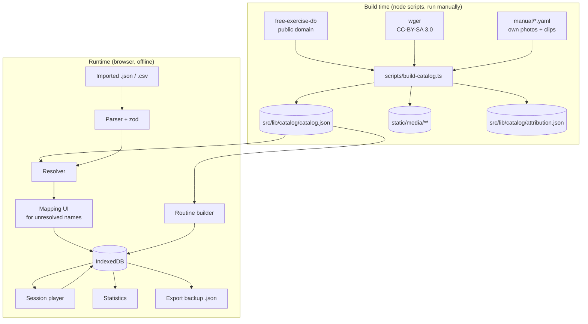
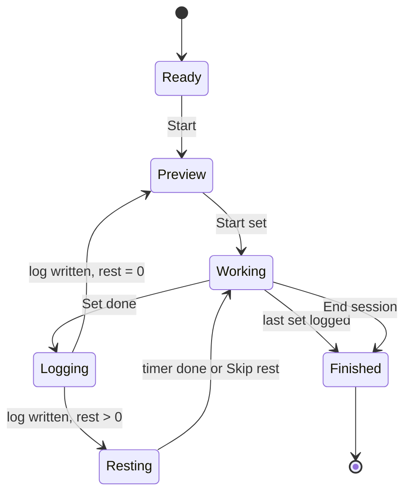

# Deadload - Design Spec

A local-first bodyweight training app. Single user, no accounts, no backend.
Runs as an installed PWA on Android.

> Named for the structural engineering term for a structure's own self-weight. In calisthenics the only load is you.

---

## 1. Purpose and scope

### What it does

- Holds a curated catalog of bodyweight exercises and stretches, **every one of which has at least one image**.
- Lets the user build and store multiple named routines (morning, evening, and so on).
- Ships with built-in preset routines for common goals (hip flexibility, back relief, upper-body strength).
- Imports routines from JSON or CSV files generated by an LLM, resolving exercise names against the catalog.
- Runs a session: manual advance through exercises, per-set logging of reps or duration, rest timer between sets.
- Exports a full backup of all data as a single JSON file.
- Later: statistics over logged sessions.

### Non-goals

Do not build any of these, and do not add abstractions in anticipation of them:

- User accounts, sync, sharing, multi-user
- Any server component
- **Gym-based training** — a rack, a cable stack, a bench press, a barbell, plates, a machine
- Nutrition, body weight tracking, habit streaks
- Play Store distribution (see §11 for the escape hatch if this changes)
- A general-purpose exercise search over the whole internet

#### Amended 2026-07-30: equipment is not the same thing as a gym

The non-goal above used to read *"weighted / equipment-based training"*, and that was never a
description of this app. §5's catalog has contained pull-ups, dips and inverted rows since M0 —
a pull-up bar and a pair of parallel bars are bought hardware, not a floor. The app therefore
already shipped equipment-based exercises while claiming not to, which meant nobody could reason
about what belonged in the catalog and what did not. Three sentences replace the one word:

- **Nothing is assumed except a floor, a wall and a chair.** Those are not purchases. Everything
  beyond them is declared in Settings and, until it is, filtered out of what the app offers
  (§5.1). Someone who owns nothing must never be shown an exercise they cannot do.
- **Leverage remains the progression model** (§4.1). Equipment is not the app's answer to "make
  this harder" — the answer is still the angle, the lever and the number of limbs. A dumbbell row
  is a movement the catalog otherwise has no way to express, not a heavier push-up.
- **Body weight is still not tracked**, and that is exactly why load is only ever recorded for an
  implement of known mass. A 10 kg kettlebell is a measurement. "Reps × plate weight" on a
  weighted pull-up is not the work done, and the honest number needs a body weight this app
  refuses to keep.

Gym training stays out for the reason it always was: it is a different place with different
constraints, and this app is used on a bedroom floor.

### Hard constraint

**Every exercise in the catalog has media.** An exercise without at least one image does not enter the catalog. This constraint drives the entire import design (§6): imports resolve *against* the catalog and never extend it.

### Note on presets

Built-in presets, especially anything labelled for pain relief, are general training routines and not medical advice. Put one line to that effect on the preset browse screen. Don't repeat it elsewhere.

---

## 2. Stack

| Concern | Choice |
|---|---|
| Framework | SvelteKit 2, Svelte 5 (runes syntax) |
| Language | TypeScript, strict mode |
| Build target | `@sveltejs/adapter-static`, fully prerendered, SPA fallback |
| Styling | Tailwind CSS v4 |
| Storage | IndexedDB via `idb` |
| PWA | `@vite-pwa/sveltekit`, Workbox precache of all app assets and media |
| Validation | `zod` for import parsing |
| Charts (M5) | `layerchart` or hand-rolled SVG. Do not pull in a heavy charting library. |
| Tests | `vitest` for the import/resolution layer |
| Deploy | Static files, packaged into a sideloaded Android APK via Capacitor (§11). Any static host also works. |

No backend. No API calls at runtime. The app must fully function in airplane mode after first load.

---

## 3. Architecture



The catalog is **build-time data committed to the repo**. The build script is run by hand when adding exercises, not on every `npm run build`. This means the app builds without network access and the catalog is reviewable in git.

### Directory layout

```
src/
  lib/
    catalog/
      catalog.json          # generated, committed
      attribution.json      # generated, committed
      index.ts              # typed loader + lookup indexes
    db/
      schema.ts             # IndexedDB store definitions + migrations
      routines.ts           # CRUD
      sessions.ts           # CRUD
      settings.ts
      backup.ts             # export / restore whole DB
    import/
      parse-json.ts
      parse-csv.ts
      resolve.ts            # name -> ExerciseId
      types.ts              # zod schemas for the import format
    session/
      player.svelte.ts      # session state machine (runes)
      rest-timer.svelte.ts
      wake-lock.ts
      audio.ts
    stats/
  routes/
    +layout.svelte
    +page.svelte            # today / routine list
    routines/[id]/
    routines/[id]/edit/
    session/[sessionId]/
    catalog/
    catalog/[exerciseId]/
    import/
    presets/
    stats/
    settings/
    about/                  # attribution lives here
static/
  media/<exercise_id>/0.webp, 1.webp, ...
  presets/*.json            # built-in routines, same format as imports
scripts/
  build-catalog.ts
  manual/*.yaml             # hand-authored catalog entries
tests/
  fixtures/imports/         # messy real LLM output, see §6.5
```

---

## 4. Data model

All types in `src/lib/types.ts`. **Metric units only.** Durations in seconds, integers.

### 4.1 Catalog (immutable, ships with the app)

```ts
type ExerciseId = string;   // snake_case slug, e.g. "worlds_greatest_stretch"

type EquipmentId =
  | 'pull_up_bar' | 'jumping_rope' | 'dumbbells'
  | 'kettlebell' | 'resistance_band' | 'foam_roller'
  | 'chair';                          // tagged, never gated — see §5.1

interface Exercise {
  id: ExerciseId;
  name: string;                       // display name
  aliases: string[];                  // alternative names for resolution
  category: 'strength' | 'stretch' | 'mobility' | 'core' | 'cardio';
  equipment: EquipmentId[];           // empty => needs nothing but a floor and a wall
  primaryMuscles: string[];
  secondaryMuscles: string[];
  level: 'beginner' | 'intermediate' | 'advanced';
  unilateral: boolean;                // true => sets are logged per side
  defaultMetric: 'reps' | 'duration'; // stretches default to duration
  instructions: string[];             // ordered cue steps
  media: MediaAsset[];                // length >= 1, enforced by build script
  attributionId: string;              // key into attribution.json
}

interface MediaAsset {
  kind: 'image' | 'video';
  path: string;                       // "/media/push_up/0.webp"
  caption?: string;                   // only if the source labels the frame; never inferred from order
  width: number;
  height: number;                     // known up front to avoid layout shift
}

interface Attribution {
  id: string;
  source: 'free-exercise-db' | 'wger' | 'wikimedia' | 'own';
  license: 'PD' | 'CC0' | 'CC-BY-SA-3.0' | 'CC-BY-SA-4.0' | 'own';
  author?: string;
  sourceUrl?: string;
}
```

#### Progression ladders

Added 2026-07-29. Calisthenics progresses by **leverage, not load**: a push-up gets harder by changing the angle, not by adding a plate. Without that, the app can describe a workout but not a training progression — the user is left editing the routine by hand to find out whether they are ready for the next variant.

A ladder is one movement's variants, easiest first:

```ts
// src/lib/catalog/ladders.ts
const ladders: ExerciseId[][] = [
  ['incline_push_up', 'pushups', 'push_ups_with_feet_elevated', 'single_arm_push_up'],
  ['scapular_pull_up', 'inverted_row', 'chin_up', 'pullups'],
  // ...
];
```

**Hand-authored, and deliberately not in `catalog.json`.** The catalog is generated from free-exercise-db, which has no notion of one exercise being a harder version of another; the ordering is editorial and belongs in a file a person is expected to argue with rather than in generated output. `level` cannot stand in for it — it ranks an exercise against the whole catalog, not against its own siblings.

Rules, enforced by `tests/ladders.test.ts` the way the build script enforces `curation.yaml`: every id exists, no exercise is on two ladders, every ladder has at least two rungs and stays inside one category, and `level` never falls as a ladder rises.

**Eight ladders is what this catalog honestly supports**, covering about half the strength exercises. Where a rung is missing it is left missing: there is no bodyweight pike push-up in the source data, so `handstand_push_ups` is on no ladder rather than sitting one rung above something four rungs easier. A rung the user cannot feel is worse than no rung, so near-duplicates (`push_up_wide` beside `pushups`) are left off too.

### 4.2 Routines (user data)

```ts
interface Routine {
  id: string;                         // uuid
  name: string;
  description?: string;
  goal?: string;                      // free text, e.g. "hip flexibility"
  tags: string[];
  blocks: Block[];
  source: 'builtin' | 'imported' | 'user';
  createdAt: string;                  // ISO 8601
  updatedAt: string;
}

interface Block {
  id: string;
  label?: string;                     // "Warm-up", "Main", "Cooldown"
  items: RoutineItem[];
  mode?: 'circuit';                   // see below; absent = straight through
}

interface RoutineItem {
  id: string;
  exerciseId: ExerciseId;
  sets: number;                       // >= 1
  target: Target;
  perSide: boolean;                   // overrides Exercise.unilateral if set
  restSeconds: number;                // rest after each set
  tempo?: string;                     // e.g. "3-1-1-0", free text, display only
  notes?: string;
  loadKg?: number;                    // mass of the implement, planned — see §4.5
}

type Target =
  | { kind: 'reps'; reps: number }
  | { kind: 'reps_range'; min: number; max: number }
  | { kind: 'duration'; seconds: number }
  | { kind: 'amrap' };                // as many reps as possible
```

Blocks exist because LLM-generated routines are naturally sectioned and because warm-up / cooldown is a real distinction during a session. A routine with no sections is stored as a single unlabelled block.

**Circuit blocks.** Added 2026-07-25. `mode: 'circuit'` runs a block round-robin — one set of each item in order, then the next round — instead of all sets of an item before the next. A superset is simply a two-item circuit block, so there is no separate superset concept. Rules, chosen so that nothing else in the app changes:

- Rounds = the largest `sets` in the block. An item with fewer sets drops out of later rounds, which means every item performs its sets in consecutive rounds from round one — so **`SetEntry.setIndex` always equals the round index**, and the log format, crash-resume, and last-time comparison are untouched.
- `restSeconds` keeps its meaning: rest after each set, wherever that set falls. A classic "rest only between rounds" circuit is expressed with 0 s on every item except the block's last. The import prompt says so.
- Per-side sets stay together within a round (left then right), same as §7 sequencing.

### 4.3 Session log (user data)

```ts
interface Session {
  id: string;
  routineId: string;
  routineName: string;                // denormalized snapshot
  startedAt: string;
  endedAt?: string;                   // absent => session abandoned or in progress
  entries: SetEntry[];
  notes?: string;
  editedAt?: string;                  // absent => every row is as the player wrote it
  swaps?: Record<string, ExerciseId>; // RoutineItem.id -> exercise actually performed (§7)
}

interface SetEntry {
  exerciseId: ExerciseId;
  itemId: string;                     // RoutineItem.id at time of performance
  setIndex: number;                   // 0-based
  side?: 'left' | 'right';            // absent for bilateral
  reps?: number;
  seconds?: number;
  rpe?: number;                       // 1-10, optional
  loadKg?: number;                    // mass of the implement, performed — see §4.5
  skipped: boolean;
  completedAt: string;
}
```

**Log one row per set, never one row per exercise.** Statistics in M5 need per-set volume, and you cannot recover it later from an aggregate. This is the single decision in the data model most expensive to get wrong.

Sessions are append-only in spirit: editing a past session is allowed but there is no partial-update path, the whole session is rewritten.

**Amended 2026-07-30: correcting a logged session.** M6 parked this and daily use made it the obvious
next gap — a mislogged set was permanent, and the only way out was deleting the whole session. The
rules live in `$lib/session/edit.ts`, pure and unit-tested per §15, and the screen is the session
detail page in History: tap a set, change what it says, save.

What can be corrected: reps or seconds, load, RPE, whether the set was skipped, and the session
note. What cannot: the exercise, the side, `completedAt`, and the session's own start and end. Those
are not corrections but a different session, and the honest way to record a workout that did not
happen this way is to log the one that did.

Four rules, each of which the UI relies on rather than reimplements:

1. **Only a finished session can be corrected.** An unfinished one belongs to the player, which finds
   its place on resume by counting entries — removing one underneath it would desync the rest of the
   workout. The detail page says so instead of offering the edit.
2. **Marking a set skipped clears its measurements.** Skipped rows mean "not done", and a not-done
   set carrying eight reps is a contradiction that would then be counted by §10's statistics.
   Un-skipping therefore has to supply reps or seconds.
3. **Removing a set renumbers what is left of that exercise**, and by *distinct* `setIndex`, so a
   per-side pair (§7) keeps sharing one number. Deleting set 2 of 3 and leaving 0 and 2 behind would
   assert there had been a third set, which is the thing being corrected.
4. **Every edit stamps `editedAt`**, and it is shown — "Corrected 30 July by hand" on the session,
   "corrected" in the history list. Statistics are built on this log, so one that can be silently
   rewritten is worth less than one that admits it was. Nothing in §10 filters corrected sessions
   out; the label is there so a surprising chart can be traced, not so the number can be discounted.

A correction is saved through the same whole-session rewrite as everything else, so backup, CSV
export and the statistics need no special case.

### 4.4 IndexedDB stores

Database `deadload`, version 1:

| Store | Key | Indexes |
|---|---|---|
| `routines` | `id` | `updatedAt`, `source` |
| `sessions` | `id` | `startedAt`, `routineId` |
| `aliasOverrides` | normalized name string | - |
| `settings` | fixed key `'app'` | - |

`aliasOverrides` maps a normalized imported name to an `ExerciseId`, written whenever the user manually resolves an unknown name (§6.3). Second import of the same phrasing then resolves silently. This is what makes repeated LLM imports stop being tedious.

Write the migration scaffolding in v1 even though there is nothing to migrate. Adding it later, with real data on the device, is worse.

### 4.5 Load

Added 2026-07-30, with §5.1. A dumbbell row is not a heavier push-up — it is a movement the
catalog has no other way to express — but the number of kilograms in the hand is the one fact about
it the app would otherwise throw away.

**`loadKg` lives in two places, and that is deliberate.** `RoutineItem.loadKg` is what the routine
*plans*; `SetEntry.loadKg` is what was *lifted*. This is exactly the relationship `target` has with
`reps`, and it exists for the same reason: the log is a record of what happened, not a pointer at
what was intended. A set done with the 8 kg because the 12 was in the other room has to be able to
say so.

Both are **optional**, so every routine, session, backup and preset written before this existed
stays valid with no migration. Absent means "not a loaded exercise", which is nearly all of them.

**Only exercises whose equipment has a mass can carry a load: `dumbbells` and `kettlebell`, and
nothing else.** A resistance band has no kilograms — its tension depends on how far it is stretched
and manufacturers' colour codes are not a unit — so putting a number on one would be inventing a
measurement. A pull-up bar has no mass in the sense that matters.

**Weighted pull-ups and dips are out of scope**, and this is the decision worth recording rather
than rediscovering. Adding a 10 kg plate to a pull-up does not make the work `reps × 10 kg`: the
load is the plate *plus the body*, and the honest number needs a body weight §1 refuses to track.
An `addedKg` field would therefore record a figure that looks like load and is not, and every
statistic built on it would inherit the error. `HANDOVER.md` §7 proposed exactly this; it is
declined on those grounds.

Consequences, all small because the field is one number:

- The player's log control gains a load stepper next to the rep stepper, prefilled from the plan,
  and carries a change forward to the rest of that exercise's sets within the session.
- The last-time line reads `12 × 10 kg, 11 × 10` — the unit is stated once and then only when the
  load changes, because a repeated unit is noise on a line read at 1 m.
- `announce.ts` says "at 10 kilos", after the target and before the side.
- CSV export gains a `load_kg` column; import accepts `load_kg` in JSON and CSV.
- Statistics treat kg-reps as a **separate currency** from sets — see §10.

### 4.6 Muscles in plain English

Added 2026-07-30, from the user: *"not everybody knows what quadriceps or adductors are"*. Quite
right, and the app was printing seventeen anatomy-textbook words at them without translation.

The vocabulary is **closed** — free-exercise-db uses exactly seventeen names — which is what makes
this tractable rather than open-ended:

`abdominals`, `abductors`, `adductors`, `biceps`, `calves`, `chest`, `forearms`, `glutes`,
`hamstrings`, `lats`, `lower back`, `middle back`, `neck`, `quadriceps`, `shoulders`, `traps`,
`triceps`.

`src/lib/catalog/muscles.ts` gives each one a `short` (two or three words, for brackets), a `where`
(somewhere you could point at) and a `does` (stated as movements, not anatomy). **Hand-authored and
deliberately not in `catalog.json`**, for the same reason as the ladders in §4.1: it is editorial
writing and belongs in a file a person is expected to argue with. `tests/muscles.test.ts` fails if
the catalog ever names a muscle this file does not explain.

Three places, and no others:

- **Exercise detail** — the body map (below), then *Works* and *Assists* with the plain-English
  gloss after each name.
- **The exercise picker and the routine editor** — `front of thigh` under the name. This is where
  "is this the exercise I want" is actually decided.
- **`/muscles/`, the compendium** — all seventeen, ordered by how much of the catalog trains each,
  each opening to a diagram, the two sentences, and a link through to the exercises that train it
  (`/catalog/?muscle=<id>`).

**Not during a session.** Mid-set the user has one glance and it belongs to the set numbers and the
countdown (§12). Anatomy is setup-time information, which is §15's rule exactly: fewer taps during a
session, more during setup.

#### The body map: a body model, coloured per muscle

Front and back figures with each trained muscle **filled in**, on a three-step ramp: grey for a muscle
not involved, light red for one assisting, strong red for one doing the work, with a legend.

The ramp matters more than the palette. An earlier version used three unrelated tones and the user's
objection was exactly right — *"it is a bit confusing that the red parts are the main muscle groups
worked, the grey are the partly applied, and then the light-reds are the ones not used"*. If the
colours do not order, the reader has to memorise a key instead of reading an intensity. They order now.

**The figures come from `svelte-body-highlighter` on npm, MIT, © 2022 ELABBASSI Hicham and © 2025
Stefan Poindl** (itself a port of `react-native-body-highlighter`). `attribution.json` records the
authors and the licence and the About page shows them, because MIT requires the notice to travel with
the work. `Attribution.covers` exists so that entry can say what it is for instead of the About page
counting zero exercises against it.

This is the third attempt, and the history is the argument for each choice:

1. A hand-drawn schematic. Rejected by the user: it read as an action figure, and one version made the
   adductor highlight look like a penis.
2. Two Wikimedia anatomical figures (`File:Muscular_system.svg`, CC BY-SA 3.0). Better, and rejected
   as *"a bit creepy"* — correctly. They are greyscale flayed musculature, and at 136 px on black with
   a coloured wash they read as a specimen on a slab. Worth recording *why* that happened: the
   greyscale was not a design decision at all. The Commons originals are over 3 MB, so a
   size-optimised copy was used, that copy happened to be flattened to seven flat greys, and nobody
   asked whether a flayed grey cadaver belonged in a workout app.
3. This one.

**Every muscle in these figures is its own group with a `data-slug`**, which is the real reason to
prefer them over any anatomical drawing. The app recolours the actual muscle shape. The previous
figures were seven flat tonal layers with nothing named, which forced an approximate ellipse per
muscle — and that limitation is now gone, along with the whole coordinate-tuning exercise that came
with it.

`src/lib/catalog/body-map.ts` is therefore a **name mapping**, not geometry: catalog muscle name → the
figure's slugs, per view. Fourteen of the seventeen map exactly. Three are approximations, and they
are named in `APPROXIMATED` and shown to the user on the compendium rather than fudged silently:

| Muscle | Region used | Why |
|---|---|---|
| `lats` | `upper-back` | the model has one region for the whole upper back |
| `middle back` | `upper-back` | the same region — the two light the same shape |
| `abductors` | `gluteal` | there is no outer-hip region, and the hip abductors *are* gluteus medius and minimus, which sit in that mass |

A correct muscle outline that is slightly coarse beats a precise ellipse in roughly the right place,
so the mapping wins over keeping hand-placed shapes for those three.

Two transforms on the way in, both applied by `build-catalog.ts`:

- `id="chest"` becomes `data-part="chest"`. Two figures on one screen would otherwise both carry
  `id="neck"`, and duplicate ids are invalid and make `#neck` ambiguous.
- The hard-coded `fill` and `stroke` values are stripped, so CSS is the only thing deciding colour.
  Left in place they beat stylesheet rules in some engines and the highlight silently does nothing.
  There is a test asserting no `fill="#` survives.

The figures are **inlined** into the bundle with Vite's `?raw`, because CSS cannot reach inside an
`` and recolouring by muscle is the entire point. Each instance tags its own copy of the markup
rather than emitting a stylesheet — the first attempt injected one style element per figure scoped by
a class derived from the view, and on the compendium, where every muscle has a figure, they all
matched each other and almost everything came out as "works".

Cost: 68 kB of SVG for both views, down from 709 kB.

---

## 5. Catalog build script

`scripts/build-catalog.ts`, run with `npm run build:catalog`. Deterministic: same inputs produce byte-identical output.

### Sources, in priority order

1. **free-exercise-db** (`yuhonas/free-exercise-db`). Public domain. Pull `dist/exercises.json`. Images at `https://raw.githubusercontent.com/yuhonas/free-exercise-db/main/exercises/<path>` — note: **not** under `dist/`, that path 404s. Filter to `equipment` in `["body only", null]` (verified 2026-07-25: 111 + 77 = 188 entries, every one with exactly two JPEG images), plus the per-equipment lists in `curation.yaml`, which pull in named rows from outside that filter and tag what they need at the same time (§5.1). Amended 2026-07-30: this replaced a bare `include:` list that added rows without recording why they were addable.
2. **wger** (`https://wger.de/api/v2/`). **Optional — verify before building anything against it.** Exercise data is predominantly CC-BY-SA 4.0 (719 of 872 bases), with some CC-BY-SA 3.0 (133) and CC0 (20) — not uniformly 3.0 as previously stated. wger has **no stretch or mobility category** (categories are muscle groups only), so gap-filling means keyword-matching English names (~53 bodyweight stretch-named entries, overlapping heavily with source 1). Image coverage for those entries is unverified as of 2026-07-25 (API unreachable from the dev environment). If used at all: attribution is mandatory, record author, source URL, and per-entry license per image. See `docs/M0-findings.md`.
3. **`scripts/manual/*.yaml`** - hand-authored entries pointing at local image or video files. This is where own-filmed content goes. Expect to need 10-20 of these, skewed toward modern dynamic mobility drills (90/90 transitions, couch stretch, CARs): source 1 turned out to carry 85 bodyweight stretches with images — static-stretch coverage is good, contemporary mobility programming is the actual gap.

### Behaviour

- Slugify ids to snake_case. Source ids are mixed-case with hyphens (`3_4_Sit-Up`), so every id gets re-slugged. Collisions are a hard error, not a silent rename.
- Map source vocabulary to the §4.1 enums: free-exercise-db `level` is `beginner | intermediate | expert` → map `expert` to `advanced`; `category` is `stretching | strength | plyometrics | cardio` in the bodyweight pool → `stretching` maps to `stretch` mechanically, but `mobility` and `core` do not exist in the source and are assigned via a hand-maintained overrides file (seed `core` from `primaryMuscles: abdominals` — 38 candidates; seed `defaultMetric: duration` from `force: "static"` — 63 candidates).
- The source provides no `aliases`, `unilateral`, `defaultMetric`, or image dimensions. `unilateral` in particular must be hand-tagged per exercise in the overrides file. This is real curation work (~120 entries) — budget it in M0, it is not free.
- Seed `aliases` from the source name, the id with underscores replaced by spaces, and any manual aliases in a `scripts/aliases.yaml` file.
- Download images, resize to max 800 px on the long edge, convert to WebP quality 80 with `sharp`. Write to `static/media/<id>/`. Record real pixel dimensions into the `MediaAsset`.
- **Drop any exercise that ends up with zero media, and print it to stderr as a warning.** The dropped list is the work queue for own-filmed content. (Verified: all 188 bodyweight entries in source 1 ship with two images, so this list is expected to be empty for source 1 — the check stays as a guard against download failures.)
- Emit `catalog.json` and `attribution.json`. Both are committed.
- Print a summary: total exercises, count per category, count per source, count dropped.

Cap the catalog at ~~roughly 120 exercises~~ — amended 2026-07-30 — **roughly 120 exercises
reachable with nothing owned, plus a hand-picked set per equipment type** (§5.1). The reason for
the cap has not changed: more than that and the resolver gets fuzzy matches you don't want and the
browse UI becomes a chore. But the number that matters is what one user actually sees, and a
dumbbell entry is invisible to someone with no dumbbells, so it cannot make their browse screen a
chore. The budgets are enforced per type in the build script, not eyeballed. Curation is a feature
here.

### 5.1 Equipment

Added 2026-07-30, with the §1 amendment. Every exercise carries `equipment: EquipmentId[]` — an
**array**, because a band-assisted pull-up needs a band *and* a bar, and one field cannot say that.
Empty means a floor and a wall.

| Id | Label | Needs | Gated |
|---|---|---|---|
| `pull_up_bar` | Pull-up bar | a doorway, wall or ceiling bar you can hang from | yes |
| `jumping_rope` | Jumping rope | a skipping rope and about 2 m of clearance | yes |
| `dumbbells` | Dumbbells | one or a pair, any weight | yes |
| `kettlebell` | Kettlebell | one, any weight | yes |
| `resistance_band` | Resistance band | a loop or tube band with handles | yes |
| `foam_roller` | Foam roller | a roller, for the self-massage entries | yes |
| `yoga_ball` | Yoga ball | a big inflatable ball, 55–75 cm — also sold as an exercise, stability or Swiss ball | yes |
| `suspension_trainer` | Suspension straps | two straps with handles, anchored to a door or a beam | yes |
| `ab_wheel` | Ab wheel | the small wheel with a handle through it | yes |
| `chair` | Chair or bench | a dining chair, sofa edge, bed, step or low table | **no** |

**A chair is not a purchase**, so it is tagged and never gated. It earns a chip on the exercise so
the user knows to fetch one, and nothing more. Everything else is something somebody had to buy,
which is exactly what makes it worth asking about.

**Gating is independent checkboxes, not one switch.** Owning a pull-up bar says nothing about
owning a kettlebell, and a single "I have equipment" toggle would show a bar owner nine kettlebell
exercises they cannot do — the failure this whole section exists to prevent.

**A gate hides an exercise from two screens and no others: catalog browse and the exercise
picker.** It never removes one from a routine the user already has, from logged history, or from a
preset. Those show an equipment chip instead. Import resolution likewise runs against the **whole**
catalog and warns rather than blocks: a routine an LLM wrote for a bar you have not ticked yet is
a reason to tick the box, not an error. Hiding is about what the app *offers*; it is never about
what the user has already decided to do.

**`pull_up_bar` starts ticked; everything else starts unticked.** Not a preference — the catalog
shipped eight pull-up-bar exercises from M0 (`pullups`, `chin_up`, `scapular_pull_up`,
`hanging_leg_raise`, `hanging_pike`, `gorilla_chin_crunch`, `bodyweight_mid_row`, `inverted_row`),
two presets use them, and one of the eight progression ladders in §4.1 is made of them. Defaulting
it off would hollow out a fresh install and break a ladder to answer a question nobody had asked
yet.

`Settings.ownedEquipment` is therefore **three-valued, and the distinction is load-bearing**:

| Value | Meaning |
|---|---|
| `undefined` | never answered → treat as `['pull_up_bar']` |
| `[]` | answered, and owns nothing → gate everything |
| `[...]` | answered |

`[]` must never collapse to the default, or a user who deliberately unticked every box gets
pull-ups back on the next launch. There is a unit test for exactly this.

#### Curation per type

Hand-picked and deliberately narrow, measured against the free-exercise-db dump of 2026-07-30
(873 entries; every candidate below ships two images):

| Type | Source pool | After cuts | Shipped | What was cut |
|---|---|---|---|---|
| `jumping_rope` | 1 usable | 1 | **1** | `Fast Skipping` is a body-only step-hop, not rope work; `Battling Ropes` is a different implement |
| `resistance_band` | 20 | 17 bench-free | **10** | one per movement pattern; skull crushers and bench presses need a bench |
| `dumbbells` | 123 | 49 bench-free | **14** | one per pattern. The 49 held nine standing triceps extensions and seven wrist curls; one extension survives, no wrist curls |
| `kettlebell` | 53 | 53, all bench-free | **9** | one per pattern out of a pool that is mostly jerk/snatch/clean variants |
| `foam_roller` | 11 | 11 | **8** | `Lower Back-SMR` — rolling the lumbar spine is not a thing to put in front of somebody unsupervised; `Brachialis-SMR` and `Peroneals-SMR` are covered by their neighbours |

**One exercise per movement pattern** is the rule that keeps these lists short. The dumbbell pool
will happily supply nine ways to extend an elbow, and nine near-identical entries make the browse
screen worse without making the training better — the same argument §4.1 uses for leaving
near-duplicate rungs off a ladder.

#### Amended 2026-07-30: three more things people already own

Asked for from the phone — a yoga ball by name, and *"other equipment that people often have in
their home, if we missed any"*. Same test as every other row in the table: is it a thing that sits
in an ordinary home, and does this source have enough of it to be worth a checkbox?

| Type | Source pool | Shipped | What was cut, and why |
|---|---|---|---|
| `yoga_ball` | 12 (`exercise ball`) | **10** | `Weighted Ball Hyperextension` and `Weighted Ball Side Bend` both put a **weight plate** behind the neck or in the hand. A plate is gym kit under §1, and the ball is not what makes those two hard |
| `suspension_trainer` | 7 (`other`, "Suspended …") | **6** | `Ring Dips` needs gymnastic rings, which are a different purchase from a strap trainer with handles |
| `ab_wheel` | 1 (`Ab Roller`) | **1** | nothing to cut |

**The build script used to refuse `exercise ball` outright**, in the same breath as `machine` and
`barbell`. That was wrong and this amendment removes it: a yoga ball is a £15 inflatable that lives
in the corner of a bedroom, and calling it gym equipment was a category error — §1's actual rule is
*"nothing is assumed except a floor, a wall and a chair, and everything else is declared in
Settings"*, which is precisely what a ball now does. `medicine ball` **stays refused**, and not out
of consistency: its 17 rows are almost all *throws* — chest passes, overhead slams, throws with a
run-up — which need a partner, a wall you are willing to hit, and a room this app is not used in.

`ab_wheel` ships one exercise, deliberately, on the precedent `jumping_rope` set below: one is the
honest count of what this source has.

`jumping_rope` ships a single exercise, and the Settings row says "1 exercise" rather than hiding
that. One is the honest count of what this source has, and a rope owner would rather see the row
say one than wonder why ticking it changed nothing.

Media cost: 58 KB per exercise, so 6.3 MB today becomes ~9 MB — comfortably inside §11's 25 MB.

#### What the build script must refuse

Beyond the existing checks, `build-catalog.ts` is a hard error when:

- A pool member's source `equipment` is a **gym** value (`machine`, `cable`, `barbell`,
  `e-z curl bar`, `medicine ball`). §1 says these are out, so a typo in `curation.yaml` must not
  quietly import a lat pulldown. `exercise ball` was on this list until 2026-07-30 and should not
  go back on it — see the amendment above.
- A pool member's source `equipment` is **not** `body only`/`null` and it carries no gated tag.
  This is the check that catches the real mistake: tagging a dumbbell exercise `chair` and shipping
  it to somebody who owns no dumbbells.
- Any per-type budget is exceeded, including the ungated one.
- A gated type ends up with **zero** exercises, which would put a checkbox in Settings that does
  nothing.

`curation.yaml`'s old `include:` list is gone. Its two entries were there to pull non-bodyweight
source rows into the pool, which is now what the per-equipment lists do — they **include and tag in
one place**, so a row cannot enter the catalog without saying what it needs.


---

## 6. Import

### 6.1 JSON format (canonical)

This is what the LLM is asked to emit. Tolerant on field names, strict on structure.

```json
{
  "schema": "deadload.routine/1",
  "name": "Morning hip mobility",
  "goal": "hip flexibility",
  "description": "15 minute daily sequence for desk-related hip tightness.",
  "tags": ["morning", "mobility"],
  "blocks": [
    {
      "label": "Warm-up",
      "items": [
        {
          "exercise": "cat_stretch",
          "sets": 1,
          "reps": 10,
          "rest_seconds": 0,
          "notes": "Move slowly, follow the breath."
        }
      ]
    },
    {
      "label": "Main",
      "items": [
        {
          "exercise": "worlds greatest stretch",
          "sets": 2,
          "duration_seconds": 45,
          "per_side": true,
          "rest_seconds": 15
        }
      ]
    }
  ]
}
```

Parser rules:

- `exercise` accepts either an `ExerciseId` or a human-readable name. Resolution decides which.
- Exactly one of `reps`, `reps_min`/`reps_max`, `duration_seconds`, or `"amrap": true`. If more than one is present, prefer `duration_seconds` for `category: stretch|mobility` exercises and `reps` otherwise, and flag it in the import report.
- Missing `sets` defaults to 1. Missing `rest_seconds` defaults to 30 for strength, 0 for stretch and mobility.
- Missing `per_side` falls back to `Exercise.unilateral`.
- Unknown top-level keys are ignored, not rejected. LLMs add fields.
- Accept a bare array of items with no `blocks` wrapper, and accept `exercises` as a synonym for `items`.
- A block with `"circuit": true` (or `"mode": "circuit"`) becomes a circuit block (§4.2). Added 2026-07-25.

Validate with zod, then map into the internal model. Keep the wire format and the internal model as separate types; do not let the import shape leak into `Routine`.

### 6.2 CSV format

One item per row. Header required, column order irrelevant, unknown columns ignored.

```csv
block,exercise,sets,reps,duration_seconds,per_side,rest_seconds,notes
Warm-up,Cat stretch,1,10,,false,0,Move slowly
Main,World's greatest stretch,2,,45,true,15,
```

Same resolution and defaulting rules. Parse with a real CSV parser (`papaparse`), not `split(',')` - notes fields will contain commas.

An optional `circuit` column marks blocks: a truthy cell (`true`, `yes`, `1`, `circuit`) on any row makes that row's whole block a circuit. Added 2026-07-25.

Markdown is explicitly not supported. If a pasted-text path is ever wanted, that is a separate feature and not part of this spec.

### 6.3 Resolution

`resolve(name: string): ResolveResult`, pure and unit-testable.

Normalization: lowercase, strip diacritics, strip all non-alphanumerics, collapse whitespace. `"World's Greatest Stretch"` and `"worlds-greatest-stretch"` normalize identically.

Cascade, first hit wins:

1. Exact `ExerciseId` match → **resolved**
2. `aliasOverrides` store hit → **resolved**
3. Normalized name matches a catalog `name` → **resolved**
4. Normalized name matches an entry in `aliases` → **resolved**
5. Token-set similarity (Dice coefficient on word bigrams) above 0.82 → **suggested**, top 3 candidates returned
6. Otherwise → **unresolved**, return top 5 candidates by similarity anyway

```ts
type ResolveResult =
  | { status: 'resolved'; exerciseId: ExerciseId; via: 'id' | 'override' | 'name' | 'alias' }
  | { status: 'suggested'; candidates: { exerciseId: ExerciseId; score: number }[] }
  | { status: 'unresolved'; candidates: { exerciseId: ExerciseId; score: number }[] };
```

**Never auto-accept a suggestion, and never create a catalog entry from an import.** A silently wrong match is worse than a prompt.

### 6.4 Import flow (UI)

1. File picker (`<input type="file" accept=".json,.csv">`). Also accept drag-and-drop and paste of raw text into a textarea, since both are one line of code and paste is convenient on desktop.
2. Parse. On failure, show the zod error path in plain language plus the offending line, and stop.
3. Show a **review screen** listing every item with its resolution status: resolved items collapsed, suggested and unresolved items expanded with a searchable catalog picker.
4. For each manual resolution, offer a "remember this name" checkbox, default on, which writes to `aliasOverrides`.
5. Unresolvable items can be dropped individually. The routine cannot be saved with any item still unresolved.
6. Save. Show the routine.

The review screen is the most important screen in the app for making the LLM workflow tolerable. Spend effort here. Nothing about it should require typing if a good candidate exists.

### 6.5 Test fixtures

`tests/fixtures/imports/` must contain real, ugly LLM output, not idealized examples. At minimum:

- Valid JSON, all names resolvable
- JSON with markdown code fences still wrapped around it
- JSON with `"sets": "3"` as a string
- JSON with both `reps` and `duration_seconds` set
- JSON with a bare items array, no blocks
- JSON with three exercises that do not exist in the catalog
- CSV with a quoted notes field containing commas
- CSV with an empty trailing row
- Something that isn't a routine at all

Strip markdown fences before parsing. It will happen constantly.

---

## 7. Session player

The core screen. Assume: phone on the floor or a bench, roughly 1 m away, user is sweaty and out of breath.

### State machine



### Requirements

- **Manual advance only.** No auto-progression through exercises. The user presses to continue. Relaxed 2026-07-29 by *Auto mode* below, which is opt-in and off by default: this still describes the app as it arrives.
- Current screen shows: exercise media (large, primary visual element), name, target for this set (`Set 2 of 3 - 45 s per side`), the countdown when the set is timed, the cue instructions collapsed behind a tap, and the log control. Order amended 2026-07-29, see below.
- Circuit blocks (§4.2) change only the *order* the flattened steps come out in — the state machine, logging, resume and undo are order-blind. Their steps read `Round 2 of 3` instead of `Set 2 of 3`, because in a circuit the round is the number worth knowing. Added 2026-07-25.

#### Media on the session screen

Decided 2026-07-25, measured against the real catalog (see `docs/M0-findings.md` §3). The browse and detail screens stack an exercise's frames vertically, which is right where vertical space is cheap. The session screen cannot afford that: the set numbers and countdown must be the largest things on screen (§12).

**Show one frame large, with a tap to swap to the other. Do not animate between them automatically.** Three reasons, in order of weight:

1. The frames are not a fixed-camera sequence. The pairs that differ *most* differ because the photographer moved: `chair_lower_back_stretch` scores highest in the catalog because frame 0 is a tight crop and frame 1 is a wide shot. Cycling those is a jump cut, not a demonstration — actively disorienting at 1 m while out of breath.
2. Frame difference cannot be used to decide automatically. Stretches have the highest median difference and cardio the lowest, the opposite of how much the body actually moves, which shows the metric mostly tracks framing changes. Any auto-animation would need a hand-tagged "this pair is a real sequence" flag per exercise.
3. §12 reserves motion for the rest countdown and set completion. A looping image during a set competes with the rep count for attention.

A tap-to-swap control degrades correctly for the exercises that have only one frame, needs no new catalog field, and still reclaims the vertical space.

**Revised 2026-07-25 after the first real workout.** Alternation is worth having, but as something the user asks for rather than something the screen does on its own. Single tap swaps one frame; **double tap alternates them every 1.4 s until tapped again**. This keeps the original objection intact — the pairs where the camera moved would be a jump cut, so nothing animates unless asked — while letting the user play the ones that do read as a movement. It adds one gesture and no chrome.

#### The working screen fits on one screen

Added 2026-07-29, measured at 360 × 808 dp, the smallest phone the app is aimed at. The countdown on a timed set started *below the fold*: the app header, a full-width 3:2 photo and the fixed log sheet (~290 dp) used the budget up, and the countdown was rendered last, under the cues. A timer you have to scroll to is not a timer — it is exactly the failure the sound cues were added to cover.

Three changes, in order of what each one buys:

1. **No app chrome during a session.** The global header — the wordmark and the Catalog/Stats/Settings nav — is suppressed on the session route and on no other route: ~80 dp back, and nothing on it is worth a tap mid-set. The player therefore owns the full height *including the top safe-area inset*, and the row holding **Leave** and the set counter is sticky, so it keeps its own strip under the status bar instead of sliding beneath it when the cues are open.
2. **Countdown above the cues.** The order is name → target → countdown → *How to do it*. The cues are read once, before the first set of an exercise; the countdown is glanced at all the way through it, and §12 puts it among the largest type in the app.
3. **The photo is capped at 30 dvh**, cropped to fill (§12). It was the single biggest consumer of height and the only element that could give any back without losing information.

The cues drop below the fold in exchange, which is the right way round for something read once. The spacer under the content clears the log sheet with the RPE row open, so they can always be scrolled to.

#### Too easy, too hard

Added 2026-07-29, with the progression ladders in §4.1. Two pills sit on the exercise photo — `↓ Easier` and `↑ Harder` — whenever the current exercise has a rung either side of it. One tap performs the neighbouring variant for the rest of that exercise: the photo, the cues and the log control all follow it, and a timed set restarts, because the seconds already spent on a movement you have just decided against do not belong to its replacement.

Three rules make this safe to do mid-set:

1. **The swap is stored on the session, not applied to the routine** (`Session.swaps`, §4.3). The routine is the user's, and rewriting it in the middle of a workout is not ours to do. It also has to survive the app being killed, which an in-memory override would not.
2. **A swap changes the exercise and nothing else.** Sets, target, rest and sides stay the item's. That keeps the step sequence exactly the same length, which is what lets the player find its place again by counting logged entries — the invariant the whole resume path rests on. The visible cost: swapping a bilateral exercise for a unilateral one performs it as the routine has it until the change is kept.
3. **Logged sets keep the exercise they were actually done with.** The log is what happened, not what was planned, so statistics see three sets of push-ups and two of incline push-ups rather than five of either.

The finished screen then offers, once, to **keep the swap in the routine** — the calm moment, when nothing is urgent, per §15's "fewer taps during a session and more taps during setup". Keeping it takes the sides from the new exercise, the same default an exercise added by hand gets. Declining leaves the routine untouched, and next time starts where today did.

Not built, and worth stating so it is a decision rather than an omission: **double progression** — hitting the top of a rep range on every set and being offered the next rung automatically. It is a rule over data that now exists, and it should be argued on its own rather than smuggled in with the ladders.

#### Get ready: the preview state

Added 2026-07-29, from the first workout with speech turned on: *"a timer on a timed exercise should not start before the exercise is read aloud"*. Quite right, and the announcement was only the visible half of it — with no rest between sets, the previous version started a hold the instant the last set was logged, while the user was still standing up, still getting onto the floor, and now also still being told what the exercise was.

**Preview** sits between one set and the next: the photo, the name, the target and the cues, with **no clock running at all**, and one large button — `Start set`, or `Start 0:45` for a timed set — that begins the set when the user is in position. Manual advance, which is the rule §7 already sets for exercises, applied to sets.

It appears wherever a set would otherwise begin the instant the previous one ended:

- After **Start**, so the session opens on the first exercise rather than on a running timer.
- After logging or skipping a set with **no rest** — including every set of a circuit, and every zero-rest mobility routine, which is precisely where the problem was.
- After **Back a set**, because redoing a set means setting up for it again.

It does **not** appear after rest. Rest is already the gap, it already shows and speaks what is coming, and its last three seconds are counted out loud — so the user is ready at zero by design. Adding a tap there would be asking a question that has already been answered.

The state is not stored as a flag. It is implied: mid-session with neither `activeStepStartedAt` nor `restEndsAt` set means *waiting to begin*. That falls out of §4.3's wall-clock rule and gives a better resume for free — killing the app on the preview returns to the preview, rather than to a timed set whose clock started while the phone was in a pocket.

#### Auto mode

Added 2026-07-29, at the user's request, once the spoken cues and the preview made a hands-free session nearly possible: *"a setting for auto mode, where the exercises go to the next after the reading is over, or after a timed exercise reaches the set time"*.

This is the one place the app is allowed to advance on its own, so it is **two independent switches in Settings, both off by default**, rather than a single mode:

| Switch | What it does |
|---|---|
| **Start sets by itself** | The preview begins the set when the announcement finishes — a beat later, so the set does not start on the last syllable. With speech off there is nothing to wait for, so a fixed get-ready window is used instead. |
| **Log timed sets by itself** | A hold logs its target at zero and moves straight on to rest or the next preview. |

Independent because the useful combinations are all four: hands-free holds, hands-free starts with a deliberate finish, and neither.

Three rules keep this honest:

1. **Reps sets are never advanced or logged automatically.** The app cannot see you finish twelve push-ups. Guessing would write numbers into the history that nobody performed, and §4.3's log is a record of what happened — a mode that quietly invents entries would poison every statistic downstream. In auto mode a reps set simply waits, exactly as it does now.
2. **The tap always beats the timer.** `Start` is still on screen and still works; the pending auto-start is cancelled by it, by leaving, by undo, and by swapping to another rung of a ladder.
3. **The screen says what it is about to do.** The preview reads *"Starts when the reading is over"*, then *"Starting on its own…"* once the countdown to begin is running. A screen that acts by itself has to admit it.

The cost, stated plainly: **auto-logging a timed set gives up overtime.** Today a hold past its target keeps counting and the longer hold is what gets measured. With this switch on, the target is logged at zero. That is the point of the mode — but it means the two switches answer different questions, and the overtime-preserving behaviour is still there with the second switch off.

#### Pausing a timed set

Added 2026-07-29. There was no way to stop a hold once it started: if the doorbell went mid-plank the only options were to log a set you had not finished or to watch the overtime climb. **Tapping the countdown pauses it, and tapping again resumes.** The countdown is the largest thing on the screen, which makes it the easiest thing to hit while out of breath, and the sub-label says which state you are in.

Pausing does **not** stop a counter, because there is no counter (§4.3). It records `pausedAt`, and resuming pushes `activeStepStartedAt` forward by exactly as long as the pause lasted — so the remaining time is unchanged, the deadline stays wall-clock, and a pause survives the app being killed. No cue sounds while paused, and auto mode cannot log a paused set.

#### Timing

Both the count-up on a timed set and the rest countdown are derived from **wall-clock deadlines persisted on the session** (`activeStepStartedAt`, `restEndsAt` in §4.3), never counted down in memory. Counting ticks loses the clock when the app is killed and drifts while the screen is off; deadlines survive both, and a rest period that expired while the app was closed is simply over on return.

#### Last time

The working screen shows what was done for this exercise in the previous finished session, under the target: `Last time, 3 days ago: 12, 11, 9`, with the set currently in progress emphasised. Per-side exercises compare like with like — the left side against the left side — because the other side is not a fair comparison.

This is the highest-value use of the per-set log (§4.3): it puts the history at the moment the decision is made, rather than on a page the user has to remember to visit. Skipped sets do not count as having done the exercise.

#### Correcting mistakes

`Log set` is the largest control on the screen and gets pressed by accident. **Back a set** removes the last logged entry and returns to that set, from either the working or the resting screen. Rest is cancelled on the way back, because the intent is to redo the set rather than to wait.

#### System back

The Android back gesture must behave like the on-screen back affordance, never close the app from mid-session. A guard stack lets whatever is on screen consume the press first — an active session raises the leave confirmation — before falling back to history, and only the home screen exits.
- Log control: a number stepper prefilled with the target reps, or a count-down for duration targets. One tap to accept the target as performed. Editing to a different number is two taps. Optional RPE is behind a secondary control and never blocks progress.
- Unilateral exercises log left and right as separate `SetEntry` rows.
- **Rest timer:** starts automatically after logging when `restSeconds > 0`. Large countdown, skip button, and `+15 s` / `-15 s` adjust. Audible beep at zero.
- **Screen Wake Lock** acquired on session start, released on finish or when the page is hidden, re-acquired on `visibilitychange` back to visible. Without this the screen sleeps mid-set.
- **Audio must be armed by a user gesture.** Create and resume the `AudioContext` on the Start button press, not at the first beep, or the first beep is silent. Use a synthesized oscillator tone, not an audio file.

#### Sound is the primary channel, not a garnish

Added 2026-07-25, after a real workout: *"if I can't see the screen, I don't know when to stop with a timed set"*. During a plank the user physically cannot look at the phone, so a silent timer is useless and a timed set with no end cue is a broken feature, not a missing nicety.

**Every moment that requires the user to act makes a sound**, and the cues differ in pitch and shape rather than volume, because volume is what varies with the room:

| Cue | When | Shape |
|---|---|---|
| `go` | a timed set starts | rising pair, quiet |
| `countdown` | last three seconds of a timed set or of rest | single tick |
| `done` | the target is reached, or rest is over | rising pair, brighter and longer — the one that has to carry across a room |
| `logged` | a set is recorded | soft low click, confirming the tap landed |
| `finished` | the session ends | three ascending notes |

All of it is switchable off in Settings, and the toggle plays the cue when switched on so the choice is audible rather than theoretical.

#### Tones say when, speech says what

Added 2026-07-29. The tones above can say *that* something changed. They cannot say what is coming, so at the end of every rest the user still has to look at the phone to find out what they are about to do — the last remaining reason to look at it mid-workout.

The app speaks the next step: **"Next up, Side Bridge. Set 2 of 3. 45 seconds. Left side."** Name first, because that is what you are waiting to hear, then the position, then the target, then the side.

The wording is a pure function (`src/lib/session/announce.ts`) and unit-tested, because it is the part worth arguing about; the speech engine itself is a thin shell around `speechSynthesis`. It is written **for the ear, not the eye**: `describeStep` renders "Set 2 of 3 · 45 s · left", which an engine reads out as "middot, forty-five s, middot". Everything spoken is spelled out — "45 seconds", "1 minute 30 seconds", "8 to 12 reps", "as many as possible" — and the set counter is dropped when there is only one set, because "set 1 of 1" is noise in a sentence you are listening to rather than reading.

**When it speaks** is the whole design:

- **As rest begins**, not as it ends. Rest is the natural gap, and by the time rest is over the `done` cue means "go" — talking over it would bury the one cue that has to carry across a room.
- **As the step begins, when there is no rest**, so zero-rest routines and circuits are not silent.
- On starting a session, on swapping to another rung of a ladder (§4.1), and on **Back a set** — each is a moment where what you are about to do has just changed.

This originally cost something: with no rest, the clock was already running while the sentence played, so a timed set lost a second or two of its hold. **Fixed the same day by the preview state below** — the answer was not to delay the clock, which would have made the logged duration a lie, but to stop starting the set on the app's schedule at all.

Speech has **its own switch**, separate from the tones, because it is more intrusive: a beep in a room with other people in it is different from a voice announcing side planks. Both default on. Where the device has no speech engine the toggle is replaced by a line saying so, rather than a control that does nothing. A local (offline) voice is preferred over a network one, so it keeps working in airplane mode.

**Corrected 2026-07-29, the same day, on a Pixel.** The first implementation used the Web Speech API alone and was silent on the phone — Settings correctly reported "this device has no speech engine" on a device with a perfectly good one. `window.speechSynthesis` **is not implemented in the Android System WebView** ([Chromium issue 40417848](https://issues.chromium.org/issues/40417848), open since 2015). Chrome on Android has it; the WebView the APK is built around does not, so the feature worked in the dev browser and nowhere the app actually runs.

So speech goes through **two engines**: `@capacitor-community/text-to-speech` to the OS text-to-speech service on Android, and `speechSynthesis` in a browser. Which one is resolved once, by platform, the same way the back-button handler decides whether Capacitor is present (§7 *System back*).

**Also corrected 2026-07-29**, from the same phone, which is set to Danish: the engine was handed `navigator.language`, so a Danish voice read out "Next up, Side Bridge". The language passed to the engine describes **the words, not the phone**. Everything spoken is English, because the catalog's exercise names are English, so `en-US` is fixed rather than read from the device. The device locale is a statement about the interface the user wants, not about which voice can pronounce this text.

The general lesson, worth more than either fix: **a browser API being present in Chromium does not mean it is present in the WebView this app ships in.** Anything reached through `window` that is not plain DOM — speech, wake lock, storage persistence, share — needs checking against the WebView, and the only way to check is on the phone.

#### Timed sets count down

A timed set counts **down** to its target, not up. Counting up gives the user nothing to act on; counting down ends at a moment worth announcing. Past zero it keeps going and shows overtime (`+0:07`), because a longer hold is worth measuring rather than clamping — the logged value still defaults to the target, so accepting it stays one tap.
- Session state persists to IndexedDB after every logged set. Killing the app mid-workout and reopening resumes exactly where it left off, with an explicit "Resume session?" prompt on the home screen.
- Skipping an exercise writes `skipped: true` entries rather than writing nothing, so that statistics can distinguish "not done" from "never prescribed".
- No back navigation traps: a confirm dialog on leaving an active session.

---

## 8. Storage durability

Browser storage can be evicted under device storage pressure or wiped by clearing browser data.

- Call `navigator.storage.persist()` on first launch. Show the result in Settings, plainly, along with what it means.
- **Export:** a single JSON file containing all routines, all sessions, alias overrides, and settings, with a `schemaVersion` field. One button in Settings, plus an automatic prompt when the session count crosses each multiple of 20.
- **Restore:** file picker, validate, then offer merge or replace. Merge deduplicates by `id`.
- The export format is a documented type in `src/lib/db/backup.ts`, not an ad-hoc `JSON.stringify` of whatever the DB happens to contain.

#### A routine on paper

Added 2026-07-30, asked for from the phone. One routine, one or two A4 pages, as a real PDF file
handed to the share sheet exactly as the backup and the CSV are.

**It is a log, not a printout of a screen.** Every set gets a box with its target printed small and
pale inside it, and the box is there to write the number in. That is the only reason to want a
routine on paper — a phone that has to stay in a pocket, somebody else following your routine, a
week away from the app — and a picture of the app on A4 would serve none of them. It carries the
name, the estimate, the description, what equipment it needs, each section, each exercise with its
sets, target, rest and notes, and a footer on every page saying which routine it is and when it was
printed.

**With the photographs, and a checkbox to leave them out.** The first version had none, on a file-size
argument, and that was wrong: somebody following the paper instead of the app cannot see the movement,
and a name is not a movement. Each one is printed 23 mm wide, and — this is the part that makes it
affordable — **scaled to that size before it is embedded**, not at catalog resolution. Measured on the
twelve-exercise *Baby in arms*: **83 kB with photographs, 6 kB without**, against the ~900 kB it would
have been at 800 px. The checkbox is for a sheet that has to photocopy or go out by email; the default
is on.

A PDF takes **JPEG verbatim and has never heard of WebP**, which the catalog ships, so the one piece of
this feature that touches the browser is `src/lib/pdf/images.ts`: decode, scale, re-encode on a canvas.
An image that fails to load is simply left out — a sheet missing one photograph beats a button that
does nothing.

**The PDF is generated in the app, by hand, in about 300 lines** (`src/lib/pdf/`). Not a library:
this is text, rules, rectangles and a JPEG the format stores as it stands.

~~and the base-14 fonts every reader already has mean no font needs embedding. The file is written as
pure ASCII~~ — **amended 2026-08-02, see §16.4.** The base-14 Helvetica is WinAnsi, which is Latin-1,
so it rendered Polish, Czech, Turkish, Greek and Cyrillic as `?` on paper, in silence. The sheet now
embeds a twice-subsetted Noto Sans and is no longer pure ASCII. What has not changed is that the file
is assembled one character per byte, so the
cross-reference offsets are string lengths — the one part of a PDF that a reader rejects outright, and
the one there is a unit test for. `describeItem` is shared with the routine screen so the paper cannot
start describing a set differently from the app.

**Why not the browser's own print.** `window.print()` is the obvious answer and it is broken exactly
where this app lives: an Android WebView has no print dialog unless the host app implements one, so
the button would do nothing on the phone and work fine in every test. Generating the bytes ourselves
works the same everywhere.

There is no PDF *import*, and there should not be: §6 resolves against the catalog, and a PDF is
where structured data goes to die.

---

## 9. Presets

Built-in presets are files in `static/presets/*.json` using the **exact import format from §6.1**. They are loaded through the same parser and resolver as user imports.

This is deliberate: the preset loading path is the import path, so the importer is exercised on every fresh install and any drift between them fails loudly.

Ship at least: hip flexibility, lower back relief, upper body strength, full body 15 minutes, desk decompression. Added 2026-07-28: push–pull supersets and a full-body circuit, both using circuit blocks (§4.2) so the feature is exercised by a preset on every fresh install.

**Added 2026-07-30: two routines to do with a baby** — *Floor time with the baby* and *Baby in arms*,
split by what the baby is doing rather than by muscle group, because in a house with a baby that is
the constraint that actually decides which workout happens.

They are the first presets whose **`notes` carry the instruction that makes the routine what it is**.
The exercises are ordinary catalog entries — a glute bridge is a glute bridge — and the note says the
baby sits on your hips for it. This is the honest way to express "exercise with a baby" under §6.3,
which forbids imports from extending the catalog: there is no `baby_wearing_squat`, and inventing one
would mean an exercise with no media, which §1's hard constraint refuses. `notes` is free text and
display-only, so it costs nothing and reaches the session screen.

Consequences worth stating, because both are the kind of thing a later edit could undo:

- **`loadKg` is not used for holding the baby**, even though a baby has a knowable mass. §4.5 limits
  load to an implement of known mass, and a held child is neither an implement nor stable — the field
  would stop meaning one thing.
- **Neither routine contains the crunch family or anything with jumping**, and there is a test
  asserting it. This is not a medical claim; it is that a routine written for somebody with a small
  baby has no business handing them sit-ups and jump squats, and the catalog's `core` category is
  mostly that. Both are also doable with nothing bought beyond a chair, since the person trying them
  is likely borrowing the phone.

---

## 10. Statistics (M5)

Derived entirely from `sessions`. No separate aggregate store, no denormalization, until it measurably matters.

- Sessions per week, last 12 weeks
- Total volume (sets, and reps where applicable) per muscle group per week
- Per-exercise progression: best set and total reps over time
- Streak of consecutive days with a completed session
- Which routines actually get used, so dead routines can be pruned

Compute on demand in a worker if it gets slow. It will not get slow at the data volumes involved here.

### 10.1 Load in statistics

Added 2026-07-30 with §4.5. **Sets are the common currency and every chart above keeps working
exactly as it did.** Kilogram-reps are a second, separate currency, and the two are never added
together or drawn on one axis.

- **A "Loaded work" section that does not exist until it has data.** It appears only once some
  logged set has a `loadKg`, which for a user who owns no dumbbells is never. An empty section
  explaining a feature they do not use is worse than no section.
- **Never stacked with the rep chart, never a shared axis.** 240 kg-reps and 24 reps are not
  comparable quantities, and putting them on one axis would make the smaller one look like nothing.
- **Per-exercise progression is where load really belongs**, and it is safe there because the
  series is one exercise: 8 kg → 10 kg → 12 kg on a one-arm row is a real progression, measured in
  a unit that means the same thing at every point on the line.
- **`volumeByMuscle` gains a `kgReps` figure, shown only where it is non-zero.** A muscle trained
  only with bodyweight work has no load number, and printing `0 kg` next to it would read as a
  result rather than an absence.
- kg-reps are summed only over sets that have **both** a load and a rep count. A loaded *timed* set
  counts as a loaded set and contributes no kg-reps, because kilogram-seconds is not the same
  quantity and averaging them together would be arithmetic on unlike units.

#### Refused, on purpose

- **Any single app-wide "total volume" number.** There is no unit in which a 45-second plank, twelve
  push-ups and eight rows with a 10 kg dumbbell add up. A number that combined them would be
  precise, prominent, and meaningless — and it is the number a user would most readily believe.
- **Any estimate of bodyweight load as a percentage of body mass.** "A push-up is 64% of your body
  weight" is a figure from a paper about other people, multiplied by a body weight this app does not
  have (§1). That is the calorie counter of §12 in a different costume: a number nobody measured,
  displayed as though somebody had.

---

## 11. PWA and platform

- `display: "standalone"`, portrait orientation, dark theme color, maskable icons at 192 and 512 px.
- Workbox precaches the app shell **and all catalog media**. The media set is the bulk of the payload; keep it under about 25 MB by respecting the WebP conversion and the 120-exercise cap. Amended 2026-08-02: the glob includes `ttf` for §16.4's embedded font, which is otherwise the one asset the service worker does not hold — the PDF button would then work everywhere except offline, and the APK registers no service worker at all, so nobody would ever have found it on the phone. Currently **23.09 MB**.
- Verify offline behaviour explicitly: install, enable airplane mode, complete a full session.
- ~~Do not add a service worker update prompt in M1. Add it once the app is in daily use, because a silently stale app is confusing.~~ **Superseded 2026-08-02.** The instinct was right and the mechanism is wrong: the app is delivered as an APK, which registers no service worker at all (see below), so there is no update prompt to add. The question it was really asking — *is the app in front of me the one I just installed?* — is answered instead by the build stamp under Settings → Data, added 2026-07-28 for exactly that reason.

### Delivery to the phone: sideloaded APK

Amended 2026-07-25. The app is delivered as a **downloadable APK, built with Capacitor** (`capacitor.config.ts`, `android/`, `.github/workflows/android.yml`), not as a hosted PWA install.

Why not the Bubblewrap/TWA route this section originally named: a Trusted Web Activity is a thin shell that loads the app *from a public HTTPS URL*, so it still requires hosting plus Digital Asset Links verification. Capacitor instead packages the static build inside the APK and serves it from a local origin, which means no hosting, no network at any point, and offline from first launch rather than after a warm-up visit. For a single-user app installed on one phone, that is strictly simpler.

Consequences, all of which the rest of this spec already accommodates:

- The service worker is not registered in the APK build (`VITE_CAPACITOR=1`); the assets are local, so a cache layer would only serve stale copies after an update. The PWA config stays, because the same build still works as a hosted PWA if that is ever wanted.
- The Android WebView is Chromium, so IndexedDB, Screen Wake Lock, and `AudioContext` (§7) all behave as specified.
- Updates are a re-download of the APK, not an automatic refresh. Every build is signed with a committed, deliberately non-secret sideload key (`android/deadload-sideload.jks`) so an updated APK installs over the previous one and **user data survives**. If that key ever changes, users must uninstall first and lose their IndexedDB data.
- Because the download URL never changes, "did the update actually install?" must be answerable from inside the app: CI stamps the build number, commit, and date into the web bundle, shown under Settings → Data as `0.1.<run> · <sha> · <date>` (`dev` outside CI). The APK's `versionCode`/`versionName` come from the same run number. Added 2026-07-28 after a stale download made the app look unchanged.
- Play Store distribution remains a non-goal (§1). Sideloading is not publishing; nothing here is designed around store requirements.

---

## 12. UI direction

Not a full visual system, but enough to avoid generic defaults:

- **Dark by default.** Used in a dim bedroom before sunrise and after sunset. A light theme is not required.
- **Legibility at 1 m beats density.** Set numbers, rep counts, and the rest countdown are the largest type in the app by a wide margin. Everything else is secondary.
- Primary session controls are at the **bottom third** of the screen, reachable one-handed, minimum 56 px touch targets.
- Media is displayed large and uncropped. The image is the reason the catalog exists; do not reduce it to a thumbnail on the session screen.
  - Amended 2026-07-29. On the *session* screen only, the photo is capped at 30 dvh and cropped to fill, because the countdown has to be on the same screen as it (§7) and the photo was what stood in the way. It is still full width and still the largest visual element there; browse and detail keep it uncropped.
- The session player runs without the app header. Mid-workout there is nothing to navigate to, and the height is worth more than the wordmark. Added 2026-07-29.
- Type: one characterful display face for numerals and headings, one neutral body face. Avoid a warm-cream-and-terracotta palette; it is the current AI-design default and reads as such.
- Motion: only the rest countdown, set-completion, and **navigation between screens** get animation. Respect `prefers-reduced-motion`.
  - Amended 2026-07-25. Screens slide in the direction travelled — forward from the right, back from the left — because the direction carries meaning that an instant swap does not, particularly with the Android back gesture where the app should feel like it moved rather than blinked. 190 ms, and skipped where the View Transitions API is absent. This is the only decorative-looking motion allowed, and it is allowed because it is not decorative.
  - Still excluded: anything animating during a set. The rep count and the countdown must be the only things moving while the user is working.
- Copy: active voice, sentence case. "Log set", not "Submit". Empty states say what to do next, not that nothing exists.

#### Navigation: a backward link must not go forward

Added 2026-07-29, from the phone: *"you can end up in a long loop where you go further inside several layers of the same page, like a babushka doll"*. Exactly right, and the cause was one mistake repeated in nine places — **every `←` affordance was an anchor to a parent URL, which is a forward navigation.** It looks like going up and behaves like going deeper. With the Android back gesture walking real history rather than the user's mental model, the two disagree until the app feels like a hall of mirrors.

Four loops existed, all instances of the same bug: `catalog/[id]` → *Progression* → `catalog/[id]` (added the same day with the ladders, and the worst of them, since every rung looks alike); routine → edit → save → routine → edit; presets → add → routine → "← Routines" → a *second* home on top of the first; and stats ↔ history, bouncing forever.

The rules now:

- **Backward and sideways navigation replaces; only drilling in pushes.** Every `←`, every ladder rung, every stats↔history hop and every `goto` after a save or delete uses `replaceState`. Going *into* something — a routine, an exercise, a logged session — still pushes, because that is a real step down.
- **Navigation lives in a bottom tab bar**, on every screen except the player. Four destinations: Routines, Catalog, Stats, Settings. However deep you are, getting out is one tap and never depends on what the back stack happens to contain. It also puts navigation at thumb height, which §12 asked for and the old top header ignored.
- **Back from the root of a tab goes home**; back from anything deeper goes up one level as it always did; back from home exits. Switching tabs replaces, so there is nothing behind a tab root — without this rule the gesture would drop out of the app from any tab.

The header is gone, which also returns ~80 dp to every screen, the same trade §7 made for the player.

#### Amended 2026-07-29, after reviewing a popular home-workout app

Twenty screenshots of Leap Fitness's *Home Workout* were read for ideas. Five were worth taking, and they are all applications of rules §12 already had:

- **Numbers, not sentences about numbers.** The finished screen said "12 sets logged"; it now shows sets, exercises and minutes as three large numerals. §12 already said numerals are the largest type in the app — the finished screen simply was not obeying it.
- **Progress as a bar.** A 4 px line under the Leave row, filling as the session goes. `7 / 21` stays for the exact count, but the bar is what reads at 1 m.
- **Facts as chips.** A routine now leads with `~5 min · 8 exercises · 11 sets` instead of a sentence. The duration estimate is information the app could always compute and never showed.
- **Thumbnails on the routine cards.** The catalog ships an image for every exercise; four of them say more about a routine than its name does.
- **A ring, not a sentence, for the auto-mode countdown.** How long you have is a quantity, so it gets a shape rather than the words "Starting on its own…".

**Deliberately not taken**, recorded so the decision is not silently revisited: the light theme and blue gradients (dark is a §12 decision, made for a dim bedroom); calorie counts (we do not measure them, and a number nobody measured is the same dishonesty as auto-logging reps — §7); weight and BMI capture (a §1 non-goal); streak flames, PRO badges and "customised for you" cards (retention machinery for an app with a business model, which this one does not have); confetti on completion (§12 allows motion only for the rest countdown, set completion and navigation); and **ALL-CAPS exercise names**, which wrap badly and read worse at a glance — exactly the legibility §12 exists to protect.

#### Ordering a routine by dragging

Added 2026-07-30, replacing the ↑/↓ buttons on each exercise in the editor.

**The drag lives on the routine screen as well as in the editor**, and the routine screen is the one
that matters: its cards are small, so a twelve-exercise routine is visible in two or three screens
rather than twelve, and moving the fourth exercise above the second is one gesture on a card you can
actually see. The editor keeps the same handle because a routine being built for the first time has
no view screen yet, and ordering it should not have to wait for a save.

Four decisions, all in `$lib/reorder.ts` and `SortableList.svelte` rather than in either screen:

1. **A handle, not a long press.** The card itself opens the exercise (below), so two gestures share
   one row. They are told apart by *where the finger lands*, not by how long it stays: a long press
   is invisible until it has already done the wrong thing, and its timeout is a guess about the user.
2. **The list does not change while the finger is down.** Only the dragged card follows the pointer;
   the others step aside by exactly its height, so a gap opens where it would land. Every card's
   measured position therefore stays true for the whole gesture and there is nothing to re-measure —
   which is what makes cards of different heights work, and a routine card grows with its notes and
   its equipment chips.
3. **Page coordinates, and the list scrolls near the edges.** A routine is taller than the screen, so
   a drag that cannot leave the viewport cannot reorder it. Measuring in page space rather than
   client space is what lets the page move under the finger without the arithmetic going wrong.
4. ~~**Within one section only** — exactly as far as the arrow buttons reached. Moving an exercise from
   Warm-up into Main is a different edit, and the editor is where it belongs.~~
   **Amended 2026-08-03: a drag crosses sections, on both screens.**

   The old rule was a description of the implementation, not a decision about the user: the drag was
   mounted once per section, so no instance could see another's cards and a drop had nowhere else to
   land. Reading it back as "Warm-up to Main is a different edit" made a limitation sound like a
   principle.

   In the editor it replaces the one edit the drag could not do at all. Moving an exercise between
   sections meant removing it and adding it again, which **loses its sets, its target, its rest and
   its notes** — that is not reordering, it is retyping, and it is worst for exactly the items worth
   keeping. On the routine screen it is allowed too, and confining it to the editor would have put
   the *more* awkward edit on the screen less suited to it: the routine screen has the small cards,
   which is the whole argument for the drag living there.

   Three things fall out, all in `$lib/reorder.ts` and unit-tested:

   - **Which section a card lands in is decided by the section's top**, not by whether the card is
     inside its box. Sections are separated by their own chrome, so a card in that gap is inside no
     section at all and "nearest" would flip back and forth across the midpoint. "The last section I
     have been carried past the top of" is monotonic: drag steadily downwards and the target only
     ever advances. There is a property test for exactly that.
   - **An empty section can be dragged into**, because it still has a top. That is new capability
     rather than a side effect — before this, a section with nothing in it could only be filled from
     the picker. It is outlined while a card is over it, which is the only cue a section with no
     cards can give.
   - **Only the destination opens a gap.** Closing the hole in the source at the same time is the
     obvious symmetric thing and it looks wrong: in the editor each section is a bordered card, so
     cards sliding up inside the section they are leaving cross that border. The gap that matters is
     the one being aimed at.

   Unchanged: a drop on the routine screen saves at once, and in the editor it stages until Save, so
   Cancel still discards a drag. Within one section the gesture behaves exactly as it did — there is
   a test asserting the new arithmetic agrees with the old on that case.

**On the routine screen a drop saves immediately.** That screen has no Save button, and inventing one
for a gesture would be worse than the gesture: the drop *is* the decision, it is visible, and
dragging the card back undoes it. In the editor a drop changes nothing on disk until Save, like every
other edit there — so Cancel still discards it.

The handle is a `<button>`, and **Arrow Up / Arrow Down on it move the exercise**. That is the only
way to reorder without a pointer, and it is what the two removed buttons did; focus follows the card
to its new position so a second press moves the same exercise again.

#### Reading about an exercise from a routine

Added 2026-07-30. Tapping an exercise in a routine — viewing one or editing one — opens what the
catalog knows about it: the photos, the muscles with the body map of §4.6, how to do it, and the
progression it belongs to.

**A sheet over the screen, not a link to the catalog page.** From the editor a link would be a defect
rather than a nicety: leaving that screen discards unsaved work, which the Cancel link says plainly.
From the routine screen it would cost the scroll position in a twelve-exercise list, to answer a
question asked in passing. So `ExerciseSheet` opens over what you were doing and closes back onto it.

It renders the **same component as the catalog page** (`ExerciseDetail`), so the two cannot drift into
describing the same exercise differently. Inside the sheet that component is `embedded`, which means
one rule: **no link may navigate.** The Settings and muscle-glossary links become plain text, and the
progression rungs move the *sheet* to that exercise instead of moving the app — which turns out to be
better than the page's links anyway, since comparing three rungs of a ladder no longer means three
navigations and three journeys back.

---

## 13. Milestones

Each milestone ends in a working, committed, usable state.

### M0 - Catalog spike

The riskiest part, so it goes first. ~~If media sourcing fails, the whole project premise changes~~ — **verified 2026-07-25** (`docs/M0-findings.md`): free-exercise-db alone yields 188 bodyweight exercises, all with two images. Media *scarcity* is retired as the premise risk. The remaining M0 risks are image quality/consistency (judge after the first WebP conversion run) and the hand-tagging pass below.

- `scripts/build-catalog.ts` running against free-exercise-db
- WebP conversion, media written to `static/media/`
- Hand-tagging pass over the pool: `unilateral`, `mobility`/`core` category assignment, `defaultMetric` — plus curation down to the 120 cap (188+ candidates means ~70 cuts)
- `catalog.json` + `attribution.json` generated and committed
- Minimal SvelteKit app: browse catalog, exercise detail page with media and instructions, attribution page
- If wger is ever to be used: a 30-minute API probe for stretch image coverage from an unrestricted network decides it. Not a build dependency.
- **Exit criteria:** at least 60 bodyweight exercises with images render offline, and the stderr list of dropped exercises has been reviewed.

### M1 - Shell, storage, routines

- PWA install working on the target device, offline load verified
- IndexedDB schema, migration scaffolding, settings store, `navigator.storage.persist()`
- Routine CRUD, manual routine builder using the catalog picker
- **Exit criteria:** a routine created by hand survives app restart and airplane mode.

### M2 - Session player

- State machine, per-set logging, rest timer, wake lock, armed audio
- Crash-resume from IndexedDB
- **Exit criteria:** a real morning workout completed end to end on the phone without touching a keyboard.

### M3 - Import

- zod schemas, JSON and CSV parsers, markdown fence stripping
- Resolver with full cascade, unit-tested against all fixtures in §6.5
- Review screen with candidate picker and alias learning
- **Exit criteria:** a routine generated by an LLM from the §14 prompt imports with zero manual mapping on the second attempt.

### M4 - Export, backup, presets

- Full backup export and restore
- Five built-in presets loaded via the import path
- **Exit criteria:** wipe browser data, restore from backup file, everything intact.

### M5 - Statistics

- The views listed in §10.

### M6 - Polish

- ~~Service worker update flow~~ — **closed 2026-08-02, by a decision made elsewhere rather than by
  being built.** §11's amendment of 2026-07-25 moved delivery to a sideloaded APK, and the APK build
  does not register a service worker, so there is no stale cache to prompt about: an update is a
  re-download of the APK. What this item was actually worried about — a user looking at a screen and
  not knowing whether it is the new version — is real, and is covered by the build stamp
  (`0.1.<run> · <sha> · <date>`) shown under Settings → Data since 2026-07-28. Recorded as closed
  rather than deleted, so nobody re-derives it from the PWA config that is still in the repo.
- Icons, empty states, whatever daily use has revealed as annoying.
- ~~Session edit~~ — done 2026-07-30, see §4.3.

---

## 14. Appendix: LLM routine prompt

Shipped in-app on the import screen, with a copy button, and with `catalog-for-llm.json` (a stripped
`{id, name, category, equipment}` list) downloadable next to it.

**Amended 2026-07-30. The catalog file is generated in the browser, not by the build script.** It
used to be a static asset, which meant it could not possibly reflect §5.1's Settings — the build
script runs on a laptop months before anyone ticks a box, so the download handed the LLM every
kettlebell exercise in the catalog and the routine that came back was unusable. It is now built from
`catalog.json` at the moment the user taps download, filtered to what they own, with an `equipment`
field per entry so the model can see why an exercise is there.

The prompt's `Constraints:` line is generated from the same source rather than left as a blank to
fill in: `Equipment available: dumbbells, jumping rope`, or `Equipment available: none — floor,
wall and chair only`. A model told what is available in a sentence produces better routines than one
left to infer it from a file, and it costs nothing to say both.

> You are writing a bodyweight training routine that will be imported into an app.
>
> Use **only** exercises from the attached catalog file, and reference them by their exact `id` value. Do not invent exercises. If the routine needs a movement that is not in the catalog, pick the closest available one and note the substitution in the item's `notes`.
>
> Output a single JSON object, no prose, no markdown fences, matching this shape:
>
> ```json
> {
>   "schema": "deadload.routine/1",
>   "name": "",
>   "goal": "",
>   "description": "",
>   "tags": [],
>   "blocks": [
>     { "label": "Warm-up", "items": [
>       { "exercise": "<catalog id>", "sets": 1, "reps": 10, "rest_seconds": 0, "notes": "" }
>     ]}
>   ]
> }
> ```
>
> Per item, use exactly one of `reps`, `duration_seconds`, `reps_min` + `reps_max`, or `"amrap": true`. Set `per_side: true` for anything performed one side at a time. All durations in seconds. Use metric units throughout.
>
> For an exercise whose `equipment` includes `dumbbells` or `kettlebell`, you may set `load_kg` to the mass of the implement in kilograms. Set it on nothing else: there is no load to record for a band, and a weighted pull-up is not supported because the real load includes body weight, which this app does not track (§4.5).
>
> To alternate exercises as a circuit or superset, set `"circuit": true` on the block: each round performs one set of every item in order. Rest is still taken after each set as its `rest_seconds` says, so for rest only between rounds give every item 0 except the block's last.
>
> Goal: **[describe the goal here]**
> Target duration: **[minutes]**
> Equipment available: **[generated from Settings — see the amendment above]**
> Constraints: **[injuries, available space, and so on]**

---

## 15. Notes for the implementer

- Svelte 5 runes throughout. Do not use the legacy store syntax.
- Keep `src/lib/import/` free of Svelte imports so it can be tested headlessly with vitest.
- The resolver and the parsers are pure functions. Everything stateful goes through `src/lib/db/`.
- Do not add a state management library. Runes plus IndexedDB is sufficient at this scale.
- Do not abstract over "future backends". There is no backend.
- When in doubt about a UI decision, favour fewer taps during a session and more taps during setup.

---

## 16. Interface language

Added 2026-08-02. The app was written in English throughout and the user is Danish.
This section is about making a second language a **file** rather than a refactor —
and about being explicit where that is not possible, because two things in this app
are English for reasons that are not laziness.

**English is the base language, and Danish is the first translation.** The base is
also the *type*: `Messages` is `typeof en`, so every other locale is a value that has
to satisfy the shape English defines.

### 16.1 What is translated, and what is not

| | |
|---|---|
| **Translated** | The 23 screens and components; the seventeen muscle names with their *where* and *does* (§4.6); the equipment labels and their *needs* sentences (§5.1); the nine preset routines — names, descriptions, section labels and per-item notes (§9); every word the printable sheet writes for itself (§8) |
| **Stays English** | The catalog: 166 exercise names, 577 instruction steps, 216 aliases; everything spoken (§7); the CSV, the backup file and the import wire format; the body of the LLM prompt (§14) |

**The catalog is data, not copy.** It is generated by `scripts/build-catalog.ts` from
free-exercise-db, and three separate things make translating it a project of its own
rather than a corner of this one:

- **The build script would overwrite it.** §5 requires the same inputs to produce
  byte-identical output, so a translation living inside `catalog.json` is destroyed by
  the next `npm run build:catalog`. It has to live in a hand-authored file beside it —
  the arrangement `ladders.ts` and the muscle glossary already use.
- **The resolver must not follow it.** §6.3 matches imported names against the English
  `name` and `aliases`, and §14's prompt quotes English ids. A translated *display*
  name must therefore change what is shown and never what is matched.
- **Speech would have to follow it.** §7 fixes the spoken language to English because
  the names being read out are English. A half-translated catalog makes that sentence
  half-true, which is worse than either end of it.

So the seam exists and is deliberately empty: `src/lib/catalog/names.ts` maps
`locale → exerciseId → name` and falls back to the English catalog name. Adding Danish
exercise names is dropping an entry into it. The exercise page says the cues are in
English rather than leaving the reader to work it out.

**Everything spoken stays English**, which is HANDOVER §5's rule unchanged and now load-
bearing in a second way: with the catalog in English, a Danish voice reading "Next up,
Side Bridge" is the exact defect found on a Pixel on 2026-07-29. `announce.ts` therefore
takes no locale, and `tests/i18n.test.ts` fails if `speech.ts` ever reads
`navigator.language` again.

**The files stay machine-readable.** The CSV, the backup and the import format are read
by other programs and by this one on another phone. A Danish `Intl.NumberFormat` writes
`2,5` for two and a half kilos, which is a column break in a comma-separated file, and a
localised date makes a backup unreadable by the app that wrote it. There is a test.

### 16.2 A typed dictionary, and no library

`src/lib/i18n/` is about 150 lines plus the dictionaries. Weighed against:

- **Paraglide/inlang** — compile-time, SvelteKit-idiomatic, and its two real wins do not
  apply here. Tree-shaking one locale per build is worthless when the APK carries every
  language at once, and locale-prefixed URLs are unaffordable (§16.3). `setLocale()` also
  reloads the page by default.
- **svelte-i18n** — runtime, and store-based, which §15 forbids.

What is left is a dictionary, and a dictionary is an object. Two properties earn it:

**Messages are values where nothing varies and functions where something does.**

```ts
export const en = {
  session: { logSet: 'Log set', setOf: (n: number, of: number) => `Set ${n} of ${of}` }
};
export type Messages = typeof en;
export const da: Messages = { … };  // a missing key, a stray key or a wrong
                                    // argument list is a compile error
```

That matters most for the sentences this app *builds* rather than looks up — `describeStep`,
`describeItem`, the last-time line — because word order lives inside a function, where a
translator can move it, instead of inside an interpolation syntax that cannot.

**Plurals, numbers, dates and lists come from `Intl`.** There were **21 hand-written
`n === 1 ? '' : 's'`** and **12 `toLocale*` calls**. Danish happens to pluralise like
English, so all 21 would have kept working while being wrong in principle — and Danish
*sæt* is invariant, Polish has four forms and Russian three. `Intl.PluralRules` takes a
`Partial<Record<LDMLPluralRule, string>>`, so a language supplies the categories it has.

**The pure layers stay pure.** The dictionaries are plain TypeScript with no runes, and
`steps.ts`, `routines.ts`, `edit.ts`, `last-time.ts` and `pdf/` take a `Messages` as an
argument — so §15's rule that they are testable headlessly under vitest survives intact.
Only `locale.svelte.ts` has state in it.

### 16.3 Where the language lives, and why not in the URL

`Settings.language` is **three-valued, exactly like `ownedEquipment` (§5.1)**:

| Value | Meaning |
|---|---|
| `undefined` | never answered → follow `navigator.languages` |
| `'en'` / `'da'` | answered, and it outranks the phone from then on |

`settings.language ?? deviceLanguage()` collapses the two and puts a Dane who
deliberately chose English back into Danish on the next launch, in silence. Same failure,
same shape, same test named after it. Settings offers "Follow the phone" as the *absence*
of an answer rather than as a third language, so choosing it clears the field.

**No locale in the URL.** Measured: the app prerenders **176 HTML files, 14 MB**, because
every one of the 167 catalog pages inlines the body figures of §4.6. A `/da/` prefix means
prerendering all of it again per language — **+14 MB against the 2 MB of headroom** left
under §11's 25 MB budget. Runtime switching costs one re-render and nothing on disk.

The cost of that, stated: the prerendered HTML on disk is English, so a Danish phone paints
English first. **Measured at ~100 ms** from navigation to the first Danish word, on a cold
load of the built app. `localStorage` mirrors the choice so it is readable synchronously at
module initialisation — IndexedDB stays the source of truth and only ever confirms it — and
`<html lang>` is set at the same moment rather than after the database read.

### 16.4 The printable sheet embeds a font

The PDF writer used the base-14 Helvetica, which every reader already has and which cost
nothing — but its WinAnsi encoding is Latin-1, so `pdfString` rendered `ł`, `ř`, `ş`, `α`
and `д` as `?`. Danish æøå was fine. That is a floor to stand on, not a foundation to add a
third language to, and the failure is silent and lands on paper.

**So the sheet embeds a subset of Noto Sans** (SIL OFL 1.1, recorded in `attribution.json`
and shown on the About page, because the OFL requires the notice to travel). The font is
cut down twice with the same code (`src/lib/pdf/truetype.ts`):

1. **At build time** — `scripts/build-fonts.ts`, run by hand and the output committed, like
   the catalog. The full Noto Sans is **621 kB per weight**; cut to a declared repertoire —
   Latin, Latin Extended-A and -B, Greek, Cyrillic and the punctuation the app writes — it
   is **114 kB per weight, 222 kB for both**.
2. **At PDF time** — cut again to the glyphs the document actually uses, which is what gets
   emailed. A twelve-exercise sheet without photographs went from **6 kB to 29 kB**.

Text is written as glyph ids (`/Encoding /Identity-H`), with a `/ToUnicode` map beside it so
the text is still selectable and searchable — and so `tests/pdf.test.ts` can read the file
back in words, which makes every assertion a check on that map too. The file is **no longer
pure ASCII**: it carries the font as it already carried the JPEGs. The one-character-per-byte
invariant is unchanged, which is what keeps the cross-reference offsets equal to string
lengths.

**What is deliberately absent from the repertoire** is as much the decision as what is in it:
no CJK, no Arabic, no Hebrew, no Devanagari. Those are tens of thousands of glyphs, or a text
shaper this writer does not have, or both — and two of them also need the right-to-left
layout §16.5 declines. A test walks every string of every shipped locale and fails on any
character the font cannot draw, so adding Polish is a file, and adding Greek is a file, and
adding Arabic fails in CI with a reason rather than on somebody's printer.

Total cost against §11's budget: precache went from **22.76 MB to 23.09 MB**.

### 16.5 Right-to-left: out, for now

Declined deliberately rather than forgotten. What it would need:

- `dir` on `<html>`, driven from the locale table beside `lang`.
- Logical properties throughout: `ps-`/`pe-`/`ms-`/`me-`/`start`/`end` in place of the
  `pl-`/`pr-`/`left-`/`right-` used across every screen. Tailwind v4 supports them; it is a
  mechanical sweep, but it is a sweep of every file.
- The page transition in `+layout.svelte`, which slides forward from the right (§12) — a
  direction that carries meaning only while reading runs left to right.
- The printable sheet: `routine-sheet.ts` lays the set boxes out from `right - n * step`,
  and the whole sheet assumes a left margin that starts a line.
- A font with the script in it, which the repertoire above does not have.

None of it is hard. All of it is untestable from here without a reader of the language, and
§16.4's test would fail on the font before any of it ran — which is the honest place for it
to stop.
