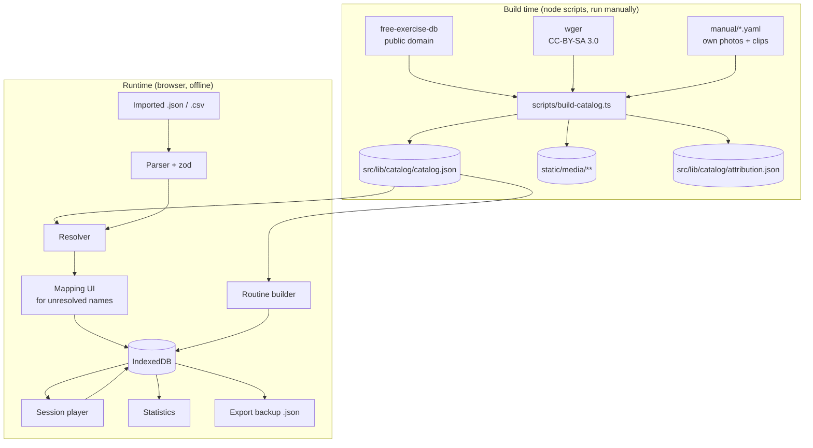
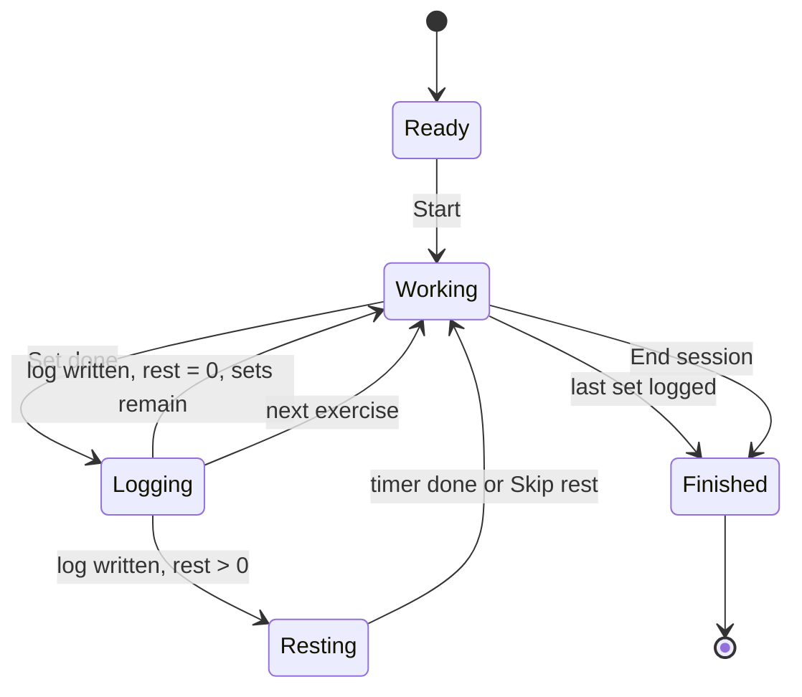

# Deadload - Design Spec

A local-first bodyweight training app. Single user, no accounts, no backend.
Runs as an installed PWA on Android.

> Named for the structural engineering term for a structure's own self-weight. In calisthenics the only load is you.

---

## 1. Purpose and scope

### What it does

- Holds a curated catalog of bodyweight exercises and stretches, **every one of which has at least one image**.
- Lets the user build and store multiple named routines (morning, evening, and so on).
- Ships with built-in preset routines for common goals (hip flexibility, back relief, upper-body strength).
- Imports routines from JSON or CSV files generated by an LLM, resolving exercise names against the catalog.
- Runs a session: manual advance through exercises, per-set logging of reps or duration, rest timer between sets.
- Exports a full backup of all data as a single JSON file.
- Later: statistics over logged sessions.

### Non-goals

Do not build any of these, and do not add abstractions in anticipation of them:

- User accounts, sync, sharing, multi-user
- Any server component
- Weighted / equipment-based training
- Nutrition, body weight tracking, habit streaks
- Play Store distribution (see §11 for the escape hatch if this changes)
- A general-purpose exercise search over the whole internet

### Hard constraint

**Every exercise in the catalog has media.** An exercise without at least one image does not enter the catalog. This constraint drives the entire import design (§6): imports resolve *against* the catalog and never extend it.

### Note on presets

Built-in presets, especially anything labelled for pain relief, are general training routines and not medical advice. Put one line to that effect on the preset browse screen. Don't repeat it elsewhere.

---

## 2. Stack

| Concern | Choice |
|---|---|
| Framework | SvelteKit 2, Svelte 5 (runes syntax) |
| Language | TypeScript, strict mode |
| Build target | `@sveltejs/adapter-static`, fully prerendered, SPA fallback |
| Styling | Tailwind CSS v4 |
| Storage | IndexedDB via `idb` |
| PWA | `@vite-pwa/sveltekit`, Workbox precache of all app assets and media |
| Validation | `zod` for import parsing |
| Charts (M5) | `layerchart` or hand-rolled SVG. Do not pull in a heavy charting library. |
| Tests | `vitest` for the import/resolution layer |
| Deploy | Static files, packaged into a sideloaded Android APK via Capacitor (§11). Any static host also works. |

No backend. No API calls at runtime. The app must fully function in airplane mode after first load.

---

## 3. Architecture



The catalog is **build-time data committed to the repo**. The build script is run by hand when adding exercises, not on every `npm run build`. This means the app builds without network access and the catalog is reviewable in git.

### Directory layout

```
src/
  lib/
    catalog/
      catalog.json          # generated, committed
      attribution.json      # generated, committed
      index.ts              # typed loader + lookup indexes
    db/
      schema.ts             # IndexedDB store definitions + migrations
      routines.ts           # CRUD
      sessions.ts           # CRUD
      settings.ts
      backup.ts             # export / restore whole DB
    import/
      parse-json.ts
      parse-csv.ts
      resolve.ts            # name -> ExerciseId
      types.ts              # zod schemas for the import format
    session/
      player.svelte.ts      # session state machine (runes)
      rest-timer.svelte.ts
      wake-lock.ts
      audio.ts
    stats/
  routes/
    +layout.svelte
    +page.svelte            # today / routine list
    routines/[id]/
    routines/[id]/edit/
    session/[sessionId]/
    catalog/
    catalog/[exerciseId]/
    import/
    presets/
    stats/
    settings/
    about/                  # attribution lives here
static/
  media/<exercise_id>/0.webp, 1.webp, ...
  presets/*.json            # built-in routines, same format as imports
scripts/
  build-catalog.ts
  manual/*.yaml             # hand-authored catalog entries
tests/
  fixtures/imports/         # messy real LLM output, see §6.5
```

---

## 4. Data model

All types in `src/lib/types.ts`. **Metric units only.** Durations in seconds, integers.

### 4.1 Catalog (immutable, ships with the app)

```ts
type ExerciseId = string;   // snake_case slug, e.g. "worlds_greatest_stretch"

interface Exercise {
  id: ExerciseId;
  name: string;                       // display name
  aliases: string[];                  // alternative names for resolution
  category: 'strength' | 'stretch' | 'mobility' | 'core' | 'cardio';
  primaryMuscles: string[];
  secondaryMuscles: string[];
  level: 'beginner' | 'intermediate' | 'advanced';
  unilateral: boolean;                // true => sets are logged per side
  defaultMetric: 'reps' | 'duration'; // stretches default to duration
  instructions: string[];             // ordered cue steps
  media: MediaAsset[];                // length >= 1, enforced by build script
  attributionId: string;              // key into attribution.json
}

interface MediaAsset {
  kind: 'image' | 'video';
  path: string;                       // "/media/push_up/0.webp"
  caption?: string;                   // only if the source labels the frame; never inferred from order
  width: number;
  height: number;                     // known up front to avoid layout shift
}

interface Attribution {
  id: string;
  source: 'free-exercise-db' | 'wger' | 'wikimedia' | 'own';
  license: 'PD' | 'CC0' | 'CC-BY-SA-3.0' | 'CC-BY-SA-4.0' | 'own';
  author?: string;
  sourceUrl?: string;
}
```

#### Progression ladders

Added 2026-07-29. Calisthenics progresses by **leverage, not load**: a push-up gets harder by changing the angle, not by adding a plate. Without that, the app can describe a workout but not a training progression — the user is left editing the routine by hand to find out whether they are ready for the next variant.

A ladder is one movement's variants, easiest first:

```ts
// src/lib/catalog/ladders.ts
const ladders: ExerciseId[][] = [
  ['incline_push_up', 'pushups', 'push_ups_with_feet_elevated', 'single_arm_push_up'],
  ['scapular_pull_up', 'inverted_row', 'chin_up', 'pullups'],
  // ...
];
```

**Hand-authored, and deliberately not in `catalog.json`.** The catalog is generated from free-exercise-db, which has no notion of one exercise being a harder version of another; the ordering is editorial and belongs in a file a person is expected to argue with rather than in generated output. `level` cannot stand in for it — it ranks an exercise against the whole catalog, not against its own siblings.

Rules, enforced by `tests/ladders.test.ts` the way the build script enforces `curation.yaml`: every id exists, no exercise is on two ladders, every ladder has at least two rungs and stays inside one category, and `level` never falls as a ladder rises.

**Eight ladders is what this catalog honestly supports**, covering about half the strength exercises. Where a rung is missing it is left missing: there is no bodyweight pike push-up in the source data, so `handstand_push_ups` is on no ladder rather than sitting one rung above something four rungs easier. A rung the user cannot feel is worse than no rung, so near-duplicates (`push_up_wide` beside `pushups`) are left off too.

### 4.2 Routines (user data)

```ts
interface Routine {
  id: string;                         // uuid
  name: string;
  description?: string;
  goal?: string;                      // free text, e.g. "hip flexibility"
  tags: string[];
  blocks: Block[];
  source: 'builtin' | 'imported' | 'user';
  createdAt: string;                  // ISO 8601
  updatedAt: string;
}

interface Block {
  id: string;
  label?: string;                     // "Warm-up", "Main", "Cooldown"
  items: RoutineItem[];
  mode?: 'circuit';                   // see below; absent = straight through
}

interface RoutineItem {
  id: string;
  exerciseId: ExerciseId;
  sets: number;                       // >= 1
  target: Target;
  perSide: boolean;                   // overrides Exercise.unilateral if set
  restSeconds: number;                // rest after each set
  tempo?: string;                     // e.g. "3-1-1-0", free text, display only
  notes?: string;
}

type Target =
  | { kind: 'reps'; reps: number }
  | { kind: 'reps_range'; min: number; max: number }
  | { kind: 'duration'; seconds: number }
  | { kind: 'amrap' };                // as many reps as possible
```

Blocks exist because LLM-generated routines are naturally sectioned and because warm-up / cooldown is a real distinction during a session. A routine with no sections is stored as a single unlabelled block.

**Circuit blocks.** Added 2026-07-25. `mode: 'circuit'` runs a block round-robin — one set of each item in order, then the next round — instead of all sets of an item before the next. A superset is simply a two-item circuit block, so there is no separate superset concept. Rules, chosen so that nothing else in the app changes:

- Rounds = the largest `sets` in the block. An item with fewer sets drops out of later rounds, which means every item performs its sets in consecutive rounds from round one — so **`SetEntry.setIndex` always equals the round index**, and the log format, crash-resume, and last-time comparison are untouched.
- `restSeconds` keeps its meaning: rest after each set, wherever that set falls. A classic "rest only between rounds" circuit is expressed with 0 s on every item except the block's last. The import prompt says so.
- Per-side sets stay together within a round (left then right), same as §7 sequencing.

### 4.3 Session log (user data)

```ts
interface Session {
  id: string;
  routineId: string;
  routineName: string;                // denormalized snapshot
  startedAt: string;
  endedAt?: string;                   // absent => session abandoned or in progress
  entries: SetEntry[];
  notes?: string;
  swaps?: Record<string, ExerciseId>; // RoutineItem.id -> exercise actually performed (§7)
}

interface SetEntry {
  exerciseId: ExerciseId;
  itemId: string;                     // RoutineItem.id at time of performance
  setIndex: number;                   // 0-based
  side?: 'left' | 'right';            // absent for bilateral
  reps?: number;
  seconds?: number;
  rpe?: number;                       // 1-10, optional
  skipped: boolean;
  completedAt: string;
}
```

**Log one row per set, never one row per exercise.** Statistics in M5 need per-set volume, and you cannot recover it later from an aggregate. This is the single decision in the data model most expensive to get wrong.

Sessions are append-only in spirit: editing a past session is allowed but there is no partial-update path, the whole session is rewritten.

### 4.4 IndexedDB stores

Database `deadload`, version 1:

| Store | Key | Indexes |
|---|---|---|
| `routines` | `id` | `updatedAt`, `source` |
| `sessions` | `id` | `startedAt`, `routineId` |
| `aliasOverrides` | normalized name string | - |
| `settings` | fixed key `'app'` | - |

`aliasOverrides` maps a normalized imported name to an `ExerciseId`, written whenever the user manually resolves an unknown name (§6.3). Second import of the same phrasing then resolves silently. This is what makes repeated LLM imports stop being tedious.

Write the migration scaffolding in v1 even though there is nothing to migrate. Adding it later, with real data on the device, is worse.

---

## 5. Catalog build script

`scripts/build-catalog.ts`, run with `npm run build:catalog`. Deterministic: same inputs produce byte-identical output.

### Sources, in priority order

1. **free-exercise-db** (`yuhonas/free-exercise-db`). Public domain. Pull `dist/exercises.json`. Images at `https://raw.githubusercontent.com/yuhonas/free-exercise-db/main/exercises/<path>` — note: **not** under `dist/`, that path 404s. Filter to `equipment` in `["body only", null]` (verified 2026-07-25: 111 + 77 = 188 entries, every one with exactly two JPEG images), plus an explicit include list in the script for anything using only a wall, floor, chair, or pull-up bar (e.g. `Dips - Chest Version` and `Band Assisted Pull-Up` sit under `equipment: "other"`).
2. **wger** (`https://wger.de/api/v2/`). **Optional — verify before building anything against it.** Exercise data is predominantly CC-BY-SA 4.0 (719 of 872 bases), with some CC-BY-SA 3.0 (133) and CC0 (20) — not uniformly 3.0 as previously stated. wger has **no stretch or mobility category** (categories are muscle groups only), so gap-filling means keyword-matching English names (~53 bodyweight stretch-named entries, overlapping heavily with source 1). Image coverage for those entries is unverified as of 2026-07-25 (API unreachable from the dev environment). If used at all: attribution is mandatory, record author, source URL, and per-entry license per image. See `docs/M0-findings.md`.
3. **`scripts/manual/*.yaml`** - hand-authored entries pointing at local image or video files. This is where own-filmed content goes. Expect to need 10-20 of these, skewed toward modern dynamic mobility drills (90/90 transitions, couch stretch, CARs): source 1 turned out to carry 85 bodyweight stretches with images — static-stretch coverage is good, contemporary mobility programming is the actual gap.

### Behaviour

- Slugify ids to snake_case. Source ids are mixed-case with hyphens (`3_4_Sit-Up`), so every id gets re-slugged. Collisions are a hard error, not a silent rename.
- Map source vocabulary to the §4.1 enums: free-exercise-db `level` is `beginner | intermediate | expert` → map `expert` to `advanced`; `category` is `stretching | strength | plyometrics | cardio` in the bodyweight pool → `stretching` maps to `stretch` mechanically, but `mobility` and `core` do not exist in the source and are assigned via a hand-maintained overrides file (seed `core` from `primaryMuscles: abdominals` — 38 candidates; seed `defaultMetric: duration` from `force: "static"` — 63 candidates).
- The source provides no `aliases`, `unilateral`, `defaultMetric`, or image dimensions. `unilateral` in particular must be hand-tagged per exercise in the overrides file. This is real curation work (~120 entries) — budget it in M0, it is not free.
- Seed `aliases` from the source name, the id with underscores replaced by spaces, and any manual aliases in a `scripts/aliases.yaml` file.
- Download images, resize to max 800 px on the long edge, convert to WebP quality 80 with `sharp`. Write to `static/media/<id>/`. Record real pixel dimensions into the `MediaAsset`.
- **Drop any exercise that ends up with zero media, and print it to stderr as a warning.** The dropped list is the work queue for own-filmed content. (Verified: all 188 bodyweight entries in source 1 ship with two images, so this list is expected to be empty for source 1 — the check stays as a guard against download failures.)
- Emit `catalog.json` and `attribution.json`. Both are committed.
- Print a summary: total exercises, count per category, count per source, count dropped.

Cap the catalog at roughly 120 exercises. More than that and the resolver gets fuzzy matches you don't want and the browse UI becomes a chore. Curation is a feature here.

---

## 6. Import

### 6.1 JSON format (canonical)

This is what the LLM is asked to emit. Tolerant on field names, strict on structure.

```json
{
  "schema": "deadload.routine/1",
  "name": "Morning hip mobility",
  "goal": "hip flexibility",
  "description": "15 minute daily sequence for desk-related hip tightness.",
  "tags": ["morning", "mobility"],
  "blocks": [
    {
      "label": "Warm-up",
      "items": [
        {
          "exercise": "cat_stretch",
          "sets": 1,
          "reps": 10,
          "rest_seconds": 0,
          "notes": "Move slowly, follow the breath."
        }
      ]
    },
    {
      "label": "Main",
      "items": [
        {
          "exercise": "worlds greatest stretch",
          "sets": 2,
          "duration_seconds": 45,
          "per_side": true,
          "rest_seconds": 15
        }
      ]
    }
  ]
}
```

Parser rules:

- `exercise` accepts either an `ExerciseId` or a human-readable name. Resolution decides which.
- Exactly one of `reps`, `reps_min`/`reps_max`, `duration_seconds`, or `"amrap": true`. If more than one is present, prefer `duration_seconds` for `category: stretch|mobility` exercises and `reps` otherwise, and flag it in the import report.
- Missing `sets` defaults to 1. Missing `rest_seconds` defaults to 30 for strength, 0 for stretch and mobility.
- Missing `per_side` falls back to `Exercise.unilateral`.
- Unknown top-level keys are ignored, not rejected. LLMs add fields.
- Accept a bare array of items with no `blocks` wrapper, and accept `exercises` as a synonym for `items`.
- A block with `"circuit": true` (or `"mode": "circuit"`) becomes a circuit block (§4.2). Added 2026-07-25.

Validate with zod, then map into the internal model. Keep the wire format and the internal model as separate types; do not let the import shape leak into `Routine`.

### 6.2 CSV format

One item per row. Header required, column order irrelevant, unknown columns ignored.

```csv
block,exercise,sets,reps,duration_seconds,per_side,rest_seconds,notes
Warm-up,Cat stretch,1,10,,false,0,Move slowly
Main,World's greatest stretch,2,,45,true,15,
```

Same resolution and defaulting rules. Parse with a real CSV parser (`papaparse`), not `split(',')` - notes fields will contain commas.

An optional `circuit` column marks blocks: a truthy cell (`true`, `yes`, `1`, `circuit`) on any row makes that row's whole block a circuit. Added 2026-07-25.

Markdown is explicitly not supported. If a pasted-text path is ever wanted, that is a separate feature and not part of this spec.

### 6.3 Resolution

`resolve(name: string): ResolveResult`, pure and unit-testable.

Normalization: lowercase, strip diacritics, strip all non-alphanumerics, collapse whitespace. `"World's Greatest Stretch"` and `"worlds-greatest-stretch"` normalize identically.

Cascade, first hit wins:

1. Exact `ExerciseId` match → **resolved**
2. `aliasOverrides` store hit → **resolved**
3. Normalized name matches a catalog `name` → **resolved**
4. Normalized name matches an entry in `aliases` → **resolved**
5. Token-set similarity (Dice coefficient on word bigrams) above 0.82 → **suggested**, top 3 candidates returned
6. Otherwise → **unresolved**, return top 5 candidates by similarity anyway

```ts
type ResolveResult =
  | { status: 'resolved'; exerciseId: ExerciseId; via: 'id' | 'override' | 'name' | 'alias' }
  | { status: 'suggested'; candidates: { exerciseId: ExerciseId; score: number }[] }
  | { status: 'unresolved'; candidates: { exerciseId: ExerciseId; score: number }[] };
```

**Never auto-accept a suggestion, and never create a catalog entry from an import.** A silently wrong match is worse than a prompt.

### 6.4 Import flow (UI)

1. File picker (`<input type="file" accept=".json,.csv">`). Also accept drag-and-drop and paste of raw text into a textarea, since both are one line of code and paste is convenient on desktop.
2. Parse. On failure, show the zod error path in plain language plus the offending line, and stop.
3. Show a **review screen** listing every item with its resolution status: resolved items collapsed, suggested and unresolved items expanded with a searchable catalog picker.
4. For each manual resolution, offer a "remember this name" checkbox, default on, which writes to `aliasOverrides`.
5. Unresolvable items can be dropped individually. The routine cannot be saved with any item still unresolved.
6. Save. Show the routine.

The review screen is the most important screen in the app for making the LLM workflow tolerable. Spend effort here. Nothing about it should require typing if a good candidate exists.

### 6.5 Test fixtures

`tests/fixtures/imports/` must contain real, ugly LLM output, not idealized examples. At minimum:

- Valid JSON, all names resolvable
- JSON with markdown code fences still wrapped around it
- JSON with `"sets": "3"` as a string
- JSON with both `reps` and `duration_seconds` set
- JSON with a bare items array, no blocks
- JSON with three exercises that do not exist in the catalog
- CSV with a quoted notes field containing commas
- CSV with an empty trailing row
- Something that isn't a routine at all

Strip markdown fences before parsing. It will happen constantly.

---

## 7. Session player

The core screen. Assume: phone on the floor or a bench, roughly 1 m away, user is sweaty and out of breath.

### State machine



### Requirements

- **Manual advance only.** No auto-progression through exercises. The user presses to continue.
- Current screen shows: exercise media (large, primary visual element), name, target for this set (`Set 2 of 3 - 45 s per side`), the countdown when the set is timed, the cue instructions collapsed behind a tap, and the log control. Order amended 2026-07-29, see below.
- Circuit blocks (§4.2) change only the *order* the flattened steps come out in — the state machine, logging, resume and undo are order-blind. Their steps read `Round 2 of 3` instead of `Set 2 of 3`, because in a circuit the round is the number worth knowing. Added 2026-07-25.

#### Media on the session screen

Decided 2026-07-25, measured against the real catalog (see `docs/M0-findings.md` §3). The browse and detail screens stack an exercise's frames vertically, which is right where vertical space is cheap. The session screen cannot afford that: the set numbers and countdown must be the largest things on screen (§12).

**Show one frame large, with a tap to swap to the other. Do not animate between them automatically.** Three reasons, in order of weight:

1. The frames are not a fixed-camera sequence. The pairs that differ *most* differ because the photographer moved: `chair_lower_back_stretch` scores highest in the catalog because frame 0 is a tight crop and frame 1 is a wide shot. Cycling those is a jump cut, not a demonstration — actively disorienting at 1 m while out of breath.
2. Frame difference cannot be used to decide automatically. Stretches have the highest median difference and cardio the lowest, the opposite of how much the body actually moves, which shows the metric mostly tracks framing changes. Any auto-animation would need a hand-tagged "this pair is a real sequence" flag per exercise.
3. §12 reserves motion for the rest countdown and set completion. A looping image during a set competes with the rep count for attention.

A tap-to-swap control degrades correctly for the exercises that have only one frame, needs no new catalog field, and still reclaims the vertical space.

**Revised 2026-07-25 after the first real workout.** Alternation is worth having, but as something the user asks for rather than something the screen does on its own. Single tap swaps one frame; **double tap alternates them every 1.4 s until tapped again**. This keeps the original objection intact — the pairs where the camera moved would be a jump cut, so nothing animates unless asked — while letting the user play the ones that do read as a movement. It adds one gesture and no chrome.

#### The working screen fits on one screen

Added 2026-07-29, measured at 360 × 808 dp, the smallest phone the app is aimed at. The countdown on a timed set started *below the fold*: the app header, a full-width 3:2 photo and the fixed log sheet (~290 dp) used the budget up, and the countdown was rendered last, under the cues. A timer you have to scroll to is not a timer — it is exactly the failure the sound cues were added to cover.

Three changes, in order of what each one buys:

1. **No app chrome during a session.** The global header — the wordmark and the Catalog/Stats/Settings nav — is suppressed on the session route and on no other route: ~80 dp back, and nothing on it is worth a tap mid-set. The player therefore owns the full height *including the top safe-area inset*, and the row holding **Leave** and the set counter is sticky, so it keeps its own strip under the status bar instead of sliding beneath it when the cues are open.
2. **Countdown above the cues.** The order is name → target → countdown → *How to do it*. The cues are read once, before the first set of an exercise; the countdown is glanced at all the way through it, and §12 puts it among the largest type in the app.
3. **The photo is capped at 30 dvh**, cropped to fill (§12). It was the single biggest consumer of height and the only element that could give any back without losing information.

The cues drop below the fold in exchange, which is the right way round for something read once. The spacer under the content clears the log sheet with the RPE row open, so they can always be scrolled to.

#### Too easy, too hard

Added 2026-07-29, with the progression ladders in §4.1. Two pills sit on the exercise photo — `↓ Easier` and `↑ Harder` — whenever the current exercise has a rung either side of it. One tap performs the neighbouring variant for the rest of that exercise: the photo, the cues and the log control all follow it, and a timed set restarts, because the seconds already spent on a movement you have just decided against do not belong to its replacement.

Three rules make this safe to do mid-set:

1. **The swap is stored on the session, not applied to the routine** (`Session.swaps`, §4.3). The routine is the user's, and rewriting it in the middle of a workout is not ours to do. It also has to survive the app being killed, which an in-memory override would not.
2. **A swap changes the exercise and nothing else.** Sets, target, rest and sides stay the item's. That keeps the step sequence exactly the same length, which is what lets the player find its place again by counting logged entries — the invariant the whole resume path rests on. The visible cost: swapping a bilateral exercise for a unilateral one performs it as the routine has it until the change is kept.
3. **Logged sets keep the exercise they were actually done with.** The log is what happened, not what was planned, so statistics see three sets of push-ups and two of incline push-ups rather than five of either.

The finished screen then offers, once, to **keep the swap in the routine** — the calm moment, when nothing is urgent, per §15's "fewer taps during a session and more taps during setup". Keeping it takes the sides from the new exercise, the same default an exercise added by hand gets. Declining leaves the routine untouched, and next time starts where today did.

Not built, and worth stating so it is a decision rather than an omission: **double progression** — hitting the top of a rep range on every set and being offered the next rung automatically. It is a rule over data that now exists, and it should be argued on its own rather than smuggled in with the ladders.

#### Timing

Both the count-up on a timed set and the rest countdown are derived from **wall-clock deadlines persisted on the session** (`activeStepStartedAt`, `restEndsAt` in §4.3), never counted down in memory. Counting ticks loses the clock when the app is killed and drifts while the screen is off; deadlines survive both, and a rest period that expired while the app was closed is simply over on return.

#### Last time

The working screen shows what was done for this exercise in the previous finished session, under the target: `Last time, 3 days ago: 12, 11, 9`, with the set currently in progress emphasised. Per-side exercises compare like with like — the left side against the left side — because the other side is not a fair comparison.

This is the highest-value use of the per-set log (§4.3): it puts the history at the moment the decision is made, rather than on a page the user has to remember to visit. Skipped sets do not count as having done the exercise.

#### Correcting mistakes

`Log set` is the largest control on the screen and gets pressed by accident. **Back a set** removes the last logged entry and returns to that set, from either the working or the resting screen. Rest is cancelled on the way back, because the intent is to redo the set rather than to wait.

#### System back

The Android back gesture must behave like the on-screen back affordance, never close the app from mid-session. A guard stack lets whatever is on screen consume the press first — an active session raises the leave confirmation — before falling back to history, and only the home screen exits.
- Log control: a number stepper prefilled with the target reps, or a count-down for duration targets. One tap to accept the target as performed. Editing to a different number is two taps. Optional RPE is behind a secondary control and never blocks progress.
- Unilateral exercises log left and right as separate `SetEntry` rows.
- **Rest timer:** starts automatically after logging when `restSeconds > 0`. Large countdown, skip button, and `+15 s` / `-15 s` adjust. Audible beep at zero.
- **Screen Wake Lock** acquired on session start, released on finish or when the page is hidden, re-acquired on `visibilitychange` back to visible. Without this the screen sleeps mid-set.
- **Audio must be armed by a user gesture.** Create and resume the `AudioContext` on the Start button press, not at the first beep, or the first beep is silent. Use a synthesized oscillator tone, not an audio file.

#### Sound is the primary channel, not a garnish

Added 2026-07-25, after a real workout: *"if I can't see the screen, I don't know when to stop with a timed set"*. During a plank the user physically cannot look at the phone, so a silent timer is useless and a timed set with no end cue is a broken feature, not a missing nicety.

**Every moment that requires the user to act makes a sound**, and the cues differ in pitch and shape rather than volume, because volume is what varies with the room:

| Cue | When | Shape |
|---|---|---|
| `go` | a timed set starts | rising pair, quiet |
| `countdown` | last three seconds of a timed set or of rest | single tick |
| `done` | the target is reached, or rest is over | rising pair, brighter and longer — the one that has to carry across a room |
| `logged` | a set is recorded | soft low click, confirming the tap landed |
| `finished` | the session ends | three ascending notes |

All of it is switchable off in Settings, and the toggle plays the cue when switched on so the choice is audible rather than theoretical.

#### Timed sets count down

A timed set counts **down** to its target, not up. Counting up gives the user nothing to act on; counting down ends at a moment worth announcing. Past zero it keeps going and shows overtime (`+0:07`), because a longer hold is worth measuring rather than clamping — the logged value still defaults to the target, so accepting it stays one tap.
- Session state persists to IndexedDB after every logged set. Killing the app mid-workout and reopening resumes exactly where it left off, with an explicit "Resume session?" prompt on the home screen.
- Skipping an exercise writes `skipped: true` entries rather than writing nothing, so that statistics can distinguish "not done" from "never prescribed".
- No back navigation traps: a confirm dialog on leaving an active session.

---

## 8. Storage durability

Browser storage can be evicted under device storage pressure or wiped by clearing browser data.

- Call `navigator.storage.persist()` on first launch. Show the result in Settings, plainly, along with what it means.
- **Export:** a single JSON file containing all routines, all sessions, alias overrides, and settings, with a `schemaVersion` field. One button in Settings, plus an automatic prompt when the session count crosses each multiple of 20.
- **Restore:** file picker, validate, then offer merge or replace. Merge deduplicates by `id`.
- The export format is a documented type in `src/lib/db/backup.ts`, not an ad-hoc `JSON.stringify` of whatever the DB happens to contain.

---

## 9. Presets

Built-in presets are files in `static/presets/*.json` using the **exact import format from §6.1**. They are loaded through the same parser and resolver as user imports.

This is deliberate: the preset loading path is the import path, so the importer is exercised on every fresh install and any drift between them fails loudly.

Ship at least: hip flexibility, lower back relief, upper body strength, full body 15 minutes, desk decompression. Added 2026-07-28: push–pull supersets and a full-body circuit, both using circuit blocks (§4.2) so the feature is exercised by a preset on every fresh install.

---

## 10. Statistics (M5)

Derived entirely from `sessions`. No separate aggregate store, no denormalization, until it measurably matters.

- Sessions per week, last 12 weeks
- Total volume (sets, and reps where applicable) per muscle group per week
- Per-exercise progression: best set and total reps over time
- Streak of consecutive days with a completed session
- Which routines actually get used, so dead routines can be pruned

Compute on demand in a worker if it gets slow. It will not get slow at the data volumes involved here.

---

## 11. PWA and platform

- `display: "standalone"`, portrait orientation, dark theme color, maskable icons at 192 and 512 px.
- Workbox precaches the app shell **and all catalog media**. The media set is the bulk of the payload; keep it under about 25 MB by respecting the WebP conversion and the 120-exercise cap.
- Verify offline behaviour explicitly: install, enable airplane mode, complete a full session.
- Do not add a service worker update prompt in M1. Add it once the app is in daily use, because a silently stale app is confusing.

### Delivery to the phone: sideloaded APK

Amended 2026-07-25. The app is delivered as a **downloadable APK, built with Capacitor** (`capacitor.config.ts`, `android/`, `.github/workflows/android.yml`), not as a hosted PWA install.

Why not the Bubblewrap/TWA route this section originally named: a Trusted Web Activity is a thin shell that loads the app *from a public HTTPS URL*, so it still requires hosting plus Digital Asset Links verification. Capacitor instead packages the static build inside the APK and serves it from a local origin, which means no hosting, no network at any point, and offline from first launch rather than after a warm-up visit. For a single-user app installed on one phone, that is strictly simpler.

Consequences, all of which the rest of this spec already accommodates:

- The service worker is not registered in the APK build (`VITE_CAPACITOR=1`); the assets are local, so a cache layer would only serve stale copies after an update. The PWA config stays, because the same build still works as a hosted PWA if that is ever wanted.
- The Android WebView is Chromium, so IndexedDB, Screen Wake Lock, and `AudioContext` (§7) all behave as specified.
- Updates are a re-download of the APK, not an automatic refresh. Every build is signed with a committed, deliberately non-secret sideload key (`android/deadload-sideload.jks`) so an updated APK installs over the previous one and **user data survives**. If that key ever changes, users must uninstall first and lose their IndexedDB data.
- Because the download URL never changes, "did the update actually install?" must be answerable from inside the app: CI stamps the build number, commit, and date into the web bundle, shown under Settings → Data as `0.1.<run> · <sha> · <date>` (`dev` outside CI). The APK's `versionCode`/`versionName` come from the same run number. Added 2026-07-28 after a stale download made the app look unchanged.
- Play Store distribution remains a non-goal (§1). Sideloading is not publishing; nothing here is designed around store requirements.

---

## 12. UI direction

Not a full visual system, but enough to avoid generic defaults:

- **Dark by default.** Used in a dim bedroom before sunrise and after sunset. A light theme is not required.
- **Legibility at 1 m beats density.** Set numbers, rep counts, and the rest countdown are the largest type in the app by a wide margin. Everything else is secondary.
- Primary session controls are at the **bottom third** of the screen, reachable one-handed, minimum 56 px touch targets.
- Media is displayed large and uncropped. The image is the reason the catalog exists; do not reduce it to a thumbnail on the session screen.
  - Amended 2026-07-29. On the *session* screen only, the photo is capped at 30 dvh and cropped to fill, because the countdown has to be on the same screen as it (§7) and the photo was what stood in the way. It is still full width and still the largest visual element there; browse and detail keep it uncropped.
- The session player runs without the app header. Mid-workout there is nothing to navigate to, and the height is worth more than the wordmark. Added 2026-07-29.
- Type: one characterful display face for numerals and headings, one neutral body face. Avoid a warm-cream-and-terracotta palette; it is the current AI-design default and reads as such.
- Motion: only the rest countdown, set-completion, and **navigation between screens** get animation. Respect `prefers-reduced-motion`.
  - Amended 2026-07-25. Screens slide in the direction travelled — forward from the right, back from the left — because the direction carries meaning that an instant swap does not, particularly with the Android back gesture where the app should feel like it moved rather than blinked. 190 ms, and skipped where the View Transitions API is absent. This is the only decorative-looking motion allowed, and it is allowed because it is not decorative.
  - Still excluded: anything animating during a set. The rep count and the countdown must be the only things moving while the user is working.
- Copy: active voice, sentence case. "Log set", not "Submit". Empty states say what to do next, not that nothing exists.

---

## 13. Milestones

Each milestone ends in a working, committed, usable state.

### M0 - Catalog spike

The riskiest part, so it goes first. ~~If media sourcing fails, the whole project premise changes~~ — **verified 2026-07-25** (`docs/M0-findings.md`): free-exercise-db alone yields 188 bodyweight exercises, all with two images. Media *scarcity* is retired as the premise risk. The remaining M0 risks are image quality/consistency (judge after the first WebP conversion run) and the hand-tagging pass below.

- `scripts/build-catalog.ts` running against free-exercise-db
- WebP conversion, media written to `static/media/`
- Hand-tagging pass over the pool: `unilateral`, `mobility`/`core` category assignment, `defaultMetric` — plus curation down to the 120 cap (188+ candidates means ~70 cuts)
- `catalog.json` + `attribution.json` generated and committed
- Minimal SvelteKit app: browse catalog, exercise detail page with media and instructions, attribution page
- If wger is ever to be used: a 30-minute API probe for stretch image coverage from an unrestricted network decides it. Not a build dependency.
- **Exit criteria:** at least 60 bodyweight exercises with images render offline, and the stderr list of dropped exercises has been reviewed.

### M1 - Shell, storage, routines

- PWA install working on the target device, offline load verified
- IndexedDB schema, migration scaffolding, settings store, `navigator.storage.persist()`
- Routine CRUD, manual routine builder using the catalog picker
- **Exit criteria:** a routine created by hand survives app restart and airplane mode.

### M2 - Session player

- State machine, per-set logging, rest timer, wake lock, armed audio
- Crash-resume from IndexedDB
- **Exit criteria:** a real morning workout completed end to end on the phone without touching a keyboard.

### M3 - Import

- zod schemas, JSON and CSV parsers, markdown fence stripping
- Resolver with full cascade, unit-tested against all fixtures in §6.5
- Review screen with candidate picker and alias learning
- **Exit criteria:** a routine generated by an LLM from the §14 prompt imports with zero manual mapping on the second attempt.

### M4 - Export, backup, presets

- Full backup export and restore
- Five built-in presets loaded via the import path
- **Exit criteria:** wipe browser data, restore from backup file, everything intact.

### M5 - Statistics

- The views listed in §10.

### M6 - Polish

- Service worker update flow, icons, empty states, session edit, whatever daily use has revealed as annoying.

---

## 14. Appendix: LLM routine prompt

Shipped in-app on the import screen, with a copy button, and with `catalog-for-llm.json` (a stripped `{id, name, category}` list emitted by the build script) downloadable next to it.

> You are writing a bodyweight training routine that will be imported into an app.
>
> Use **only** exercises from the attached catalog file, and reference them by their exact `id` value. Do not invent exercises. If the routine needs a movement that is not in the catalog, pick the closest available one and note the substitution in the item's `notes`.
>
> Output a single JSON object, no prose, no markdown fences, matching this shape:
>
> ```json
> {
>   "schema": "deadload.routine/1",
>   "name": "",
>   "goal": "",
>   "description": "",
>   "tags": [],
>   "blocks": [
>     { "label": "Warm-up", "items": [
>       { "exercise": "<catalog id>", "sets": 1, "reps": 10, "rest_seconds": 0, "notes": "" }
>     ]}
>   ]
> }
> ```
>
> Per item, use exactly one of `reps`, `duration_seconds`, `reps_min` + `reps_max`, or `"amrap": true`. Set `per_side: true` for anything performed one side at a time. All durations in seconds. Use metric units throughout.
>
> To alternate exercises as a circuit or superset, set `"circuit": true` on the block: each round performs one set of every item in order. Rest is still taken after each set as its `rest_seconds` says, so for rest only between rounds give every item 0 except the block's last.
>
> Goal: **[describe the goal here]**
> Target duration: **[minutes]**
> Constraints: **[injuries, available space, floor only, pull-up bar available, and so on]**

---

## 15. Notes for the implementer

- Svelte 5 runes throughout. Do not use the legacy store syntax.
- Keep `src/lib/import/` free of Svelte imports so it can be tested headlessly with vitest.
- The resolver and the parsers are pure functions. Everything stateful goes through `src/lib/db/`.
- Do not add a state management library. Runes plus IndexedDB is sufficient at this scale.
- Do not abstract over "future backends". There is no backend.
- When in doubt about a UI decision, favour fewer taps during a session and more taps during setup.
