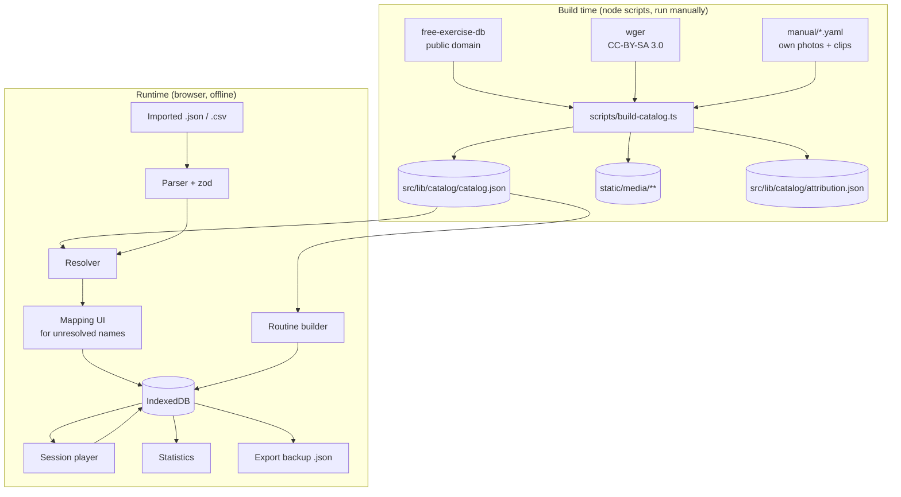
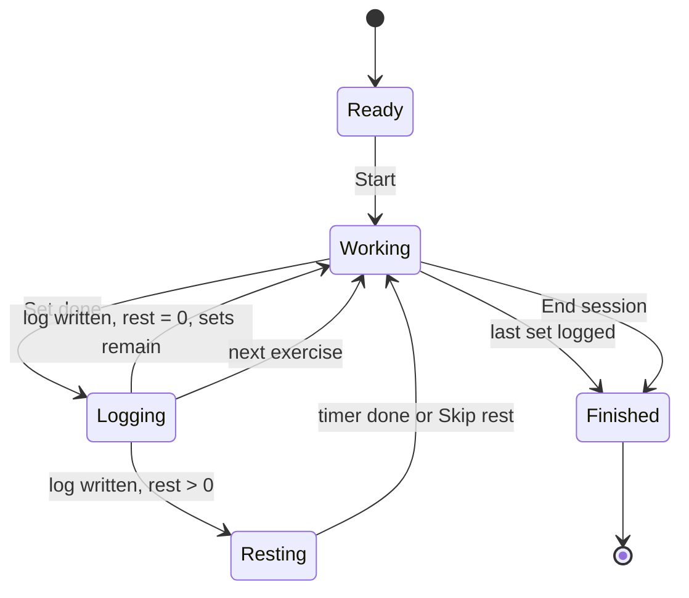

# Rutine - Design Spec

A local-first bodyweight training app. Single user, no accounts, no backend.
Runs as an installed PWA on Android.

> Rename freely. `rutine` is a placeholder chosen because it's short and unambiguous.

---

## 1. Purpose and scope

### What it does

- Holds a curated catalog of bodyweight exercises and stretches, **every one of which has at least one image**.
- Lets the user build and store multiple named routines (morning, evening, and so on).
- Ships with built-in preset routines for common goals (hip flexibility, back relief, upper-body strength).
- Imports routines from JSON or CSV files generated by an LLM, resolving exercise names against the catalog.
- Runs a session: manual advance through exercises, per-set logging of reps or duration, rest timer between sets.
- Exports a full backup of all data as a single JSON file.
- Later: statistics over logged sessions.

### Non-goals

Do not build any of these, and do not add abstractions in anticipation of them:

- User accounts, sync, sharing, multi-user
- Any server component
- Weighted / equipment-based training
- Nutrition, body weight tracking, habit streaks
- Play Store distribution (see §11 for the escape hatch if this changes)
- A general-purpose exercise search over the whole internet

### Hard constraint

**Every exercise in the catalog has media.** An exercise without at least one image does not enter the catalog. This constraint drives the entire import design (§6): imports resolve *against* the catalog and never extend it.

### Note on presets

Built-in presets, especially anything labelled for pain relief, are general training routines and not medical advice. Put one line to that effect on the preset browse screen. Don't repeat it elsewhere.

---

## 2. Stack

| Concern | Choice |
|---|---|
| Framework | SvelteKit 2, Svelte 5 (runes syntax) |
| Language | TypeScript, strict mode |
| Build target | `@sveltejs/adapter-static`, fully prerendered, SPA fallback |
| Styling | Tailwind CSS v4 |
| Storage | IndexedDB via `idb` |
| PWA | `@vite-pwa/sveltekit`, Workbox precache of all app assets and media |
| Validation | `zod` for import parsing |
| Charts (M5) | `layerchart` or hand-rolled SVG. Do not pull in a heavy charting library. |
| Tests | `vitest` for the import/resolution layer |
| Deploy | Static files. GitHub Pages or any static host. |

No backend. No API calls at runtime. The app must fully function in airplane mode after first load.

---

## 3. Architecture



The catalog is **build-time data committed to the repo**. The build script is run by hand when adding exercises, not on every `npm run build`. This means the app builds without network access and the catalog is reviewable in git.

### Directory layout

```
src/
  lib/
    catalog/
      catalog.json          # generated, committed
      attribution.json      # generated, committed
      index.ts              # typed loader + lookup indexes
    db/
      schema.ts             # IndexedDB store definitions + migrations
      routines.ts           # CRUD
      sessions.ts           # CRUD
      settings.ts
      backup.ts             # export / restore whole DB
    import/
      parse-json.ts
      parse-csv.ts
      resolve.ts            # name -> ExerciseId
      types.ts              # zod schemas for the import format
    session/
      player.svelte.ts      # session state machine (runes)
      rest-timer.svelte.ts
      wake-lock.ts
      audio.ts
    stats/
  routes/
    +layout.svelte
    +page.svelte            # today / routine list
    routines/[id]/
    routines/[id]/edit/
    session/[sessionId]/
    catalog/
    catalog/[exerciseId]/
    import/
    presets/
    stats/
    settings/
    about/                  # attribution lives here
static/
  media/<exercise_id>/0.webp, 1.webp, ...
  presets/*.json            # built-in routines, same format as imports
scripts/
  build-catalog.ts
  manual/*.yaml             # hand-authored catalog entries
tests/
  fixtures/imports/         # messy real LLM output, see §6.5
```

---

## 4. Data model

All types in `src/lib/types.ts`. **Metric units only.** Durations in seconds, integers.

### 4.1 Catalog (immutable, ships with the app)

```ts
type ExerciseId = string;   // snake_case slug, e.g. "worlds_greatest_stretch"

interface Exercise {
  id: ExerciseId;
  name: string;                       // display name
  aliases: string[];                  // alternative names for resolution
  category: 'strength' | 'stretch' | 'mobility' | 'core' | 'cardio';
  primaryMuscles: string[];
  secondaryMuscles: string[];
  level: 'beginner' | 'intermediate' | 'advanced';
  unilateral: boolean;                // true => sets are logged per side
  defaultMetric: 'reps' | 'duration'; // stretches default to duration
  instructions: string[];             // ordered cue steps
  media: MediaAsset[];                // length >= 1, enforced by build script
  attributionId: string;              // key into attribution.json
}

interface MediaAsset {
  kind: 'image' | 'video';
  path: string;                       // "/media/push_up/0.webp"
  caption?: string;                   // typically "Start" / "End"
  width: number;
  height: number;                     // known up front to avoid layout shift
}

interface Attribution {
  id: string;
  source: 'free-exercise-db' | 'wger' | 'wikimedia' | 'own';
  license: 'PD' | 'CC-BY-SA-3.0' | 'CC-BY-SA-4.0' | 'own';
  author?: string;
  sourceUrl?: string;
}
```

### 4.2 Routines (user data)

```ts
interface Routine {
  id: string;                         // uuid
  name: string;
  description?: string;
  goal?: string;                      // free text, e.g. "hip flexibility"
  tags: string[];
  blocks: Block[];
  source: 'builtin' | 'imported' | 'user';
  createdAt: string;                  // ISO 8601
  updatedAt: string;
}

interface Block {
  id: string;
  label?: string;                     // "Warm-up", "Main", "Cooldown"
  items: RoutineItem[];
}

interface RoutineItem {
  id: string;
  exerciseId: ExerciseId;
  sets: number;                       // >= 1
  target: Target;
  perSide: boolean;                   // overrides Exercise.unilateral if set
  restSeconds: number;                // rest after each set
  tempo?: string;                     // e.g. "3-1-1-0", free text, display only
  notes?: string;
}

type Target =
  | { kind: 'reps'; reps: number }
  | { kind: 'reps_range'; min: number; max: number }
  | { kind: 'duration'; seconds: number }
  | { kind: 'amrap' };                // as many reps as possible
```

Blocks exist because LLM-generated routines are naturally sectioned and because warm-up / cooldown is a real distinction during a session. A routine with no sections is stored as a single unlabelled block.

### 4.3 Session log (user data)

```ts
interface Session {
  id: string;
  routineId: string;
  routineName: string;                // denormalized snapshot
  startedAt: string;
  endedAt?: string;                   // absent => session abandoned or in progress
  entries: SetEntry[];
  notes?: string;
}

interface SetEntry {
  exerciseId: ExerciseId;
  itemId: string;                     // RoutineItem.id at time of performance
  setIndex: number;                   // 0-based
  side?: 'left' | 'right';            // absent for bilateral
  reps?: number;
  seconds?: number;
  rpe?: number;                       // 1-10, optional
  skipped: boolean;
  completedAt: string;
}
```

**Log one row per set, never one row per exercise.** Statistics in M5 need per-set volume, and you cannot recover it later from an aggregate. This is the single decision in the data model most expensive to get wrong.

Sessions are append-only in spirit: editing a past session is allowed but there is no partial-update path, the whole session is rewritten.

### 4.4 IndexedDB stores

Database `rutine`, version 1:

| Store | Key | Indexes |
|---|---|---|
| `routines` | `id` | `updatedAt`, `source` |
| `sessions` | `id` | `startedAt`, `routineId` |
| `aliasOverrides` | normalized name string | - |
| `settings` | fixed key `'app'` | - |

`aliasOverrides` maps a normalized imported name to an `ExerciseId`, written whenever the user manually resolves an unknown name (§6.3). Second import of the same phrasing then resolves silently. This is what makes repeated LLM imports stop being tedious.

Write the migration scaffolding in v1 even though there is nothing to migrate. Adding it later, with real data on the device, is worse.

---

## 5. Catalog build script

`scripts/build-catalog.ts`, run with `npm run build:catalog`. Deterministic: same inputs produce byte-identical output.

### Sources, in priority order

1. **free-exercise-db** (`yuhonas/free-exercise-db`). Public domain. Pull `dist/exercises.json`. Images at `https://raw.githubusercontent.com/yuhonas/free-exercise-db/main/dist/exercises/<path>`. Filter to `equipment` in `["body only", null]`, plus an explicit include list in the script for anything using only a wall, floor, chair, or pull-up bar.
2. **wger** (`https://wger.de/api/v2/`). Exercise data CC-BY-SA 3.0, images a smaller subset than the exercise list. Use only to fill gaps left by source 1, primarily stretches and mobility work. Attribution is mandatory, record author and source URL per image.
3. **`scripts/manual/*.yaml`** - hand-authored entries pointing at local image or video files. This is where own-filmed stretches go. Expect to need 10-20 of these; the two databases thin out badly on mobility work, which is exactly what the hip-flexibility and back-relief presets need.

### Behaviour

- Slugify ids to snake_case. Collisions are a hard error, not a silent rename.
- Seed `aliases` from the source name, the id with underscores replaced by spaces, and any manual aliases in a `scripts/aliases.yaml` file.
- Download images, resize to max 800 px on the long edge, convert to WebP quality 80 with `sharp`. Write to `static/media/<id>/`. Record real pixel dimensions into the `MediaAsset`.
- **Drop any exercise that ends up with zero media, and print it to stderr as a warning.** The dropped list is the work queue for own-filmed content.
- Emit `catalog.json` and `attribution.json`. Both are committed.
- Print a summary: total exercises, count per category, count per source, count dropped.

Cap the catalog at roughly 120 exercises. More than that and the resolver gets fuzzy matches you don't want and the browse UI becomes a chore. Curation is a feature here.

---

## 6. Import

### 6.1 JSON format (canonical)

This is what the LLM is asked to emit. Tolerant on field names, strict on structure.

```json
{
  "schema": "rutine.routine/1",
  "name": "Morning hip mobility",
  "goal": "hip flexibility",
  "description": "15 minute daily sequence for desk-related hip tightness.",
  "tags": ["morning", "mobility"],
  "blocks": [
    {
      "label": "Warm-up",
      "items": [
        {
          "exercise": "cat_stretch",
          "sets": 1,
          "reps": 10,
          "rest_seconds": 0,
          "notes": "Move slowly, follow the breath."
        }
      ]
    },
    {
      "label": "Main",
      "items": [
        {
          "exercise": "worlds greatest stretch",
          "sets": 2,
          "duration_seconds": 45,
          "per_side": true,
          "rest_seconds": 15
        }
      ]
    }
  ]
}
```

Parser rules:

- `exercise` accepts either an `ExerciseId` or a human-readable name. Resolution decides which.
- Exactly one of `reps`, `reps_min`/`reps_max`, `duration_seconds`, or `"amrap": true`. If more than one is present, prefer `duration_seconds` for `category: stretch|mobility` exercises and `reps` otherwise, and flag it in the import report.
- Missing `sets` defaults to 1. Missing `rest_seconds` defaults to 30 for strength, 0 for stretch and mobility.
- Missing `per_side` falls back to `Exercise.unilateral`.
- Unknown top-level keys are ignored, not rejected. LLMs add fields.
- Accept a bare array of items with no `blocks` wrapper, and accept `exercises` as a synonym for `items`.

Validate with zod, then map into the internal model. Keep the wire format and the internal model as separate types; do not let the import shape leak into `Routine`.

### 6.2 CSV format

One item per row. Header required, column order irrelevant, unknown columns ignored.

```csv
block,exercise,sets,reps,duration_seconds,per_side,rest_seconds,notes
Warm-up,Cat stretch,1,10,,false,0,Move slowly
Main,World's greatest stretch,2,,45,true,15,
```

Same resolution and defaulting rules. Parse with a real CSV parser (`papaparse`), not `split(',')` - notes fields will contain commas.

Markdown is explicitly not supported. If a pasted-text path is ever wanted, that is a separate feature and not part of this spec.

### 6.3 Resolution

`resolve(name: string): ResolveResult`, pure and unit-testable.

Normalization: lowercase, strip diacritics, strip all non-alphanumerics, collapse whitespace. `"World's Greatest Stretch"` and `"worlds-greatest-stretch"` normalize identically.

Cascade, first hit wins:

1. Exact `ExerciseId` match → **resolved**
2. `aliasOverrides` store hit → **resolved**
3. Normalized name matches a catalog `name` → **resolved**
4. Normalized name matches an entry in `aliases` → **resolved**
5. Token-set similarity (Dice coefficient on word bigrams) above 0.82 → **suggested**, top 3 candidates returned
6. Otherwise → **unresolved**, return top 5 candidates by similarity anyway

```ts
type ResolveResult =
  | { status: 'resolved'; exerciseId: ExerciseId; via: 'id' | 'override' | 'name' | 'alias' }
  | { status: 'suggested'; candidates: { exerciseId: ExerciseId; score: number }[] }
  | { status: 'unresolved'; candidates: { exerciseId: ExerciseId; score: number }[] };
```

**Never auto-accept a suggestion, and never create a catalog entry from an import.** A silently wrong match is worse than a prompt.

### 6.4 Import flow (UI)

1. File picker (`<input type="file" accept=".json,.csv">`). Also accept drag-and-drop and paste of raw text into a textarea, since both are one line of code and paste is convenient on desktop.
2. Parse. On failure, show the zod error path in plain language plus the offending line, and stop.
3. Show a **review screen** listing every item with its resolution status: resolved items collapsed, suggested and unresolved items expanded with a searchable catalog picker.
4. For each manual resolution, offer a "remember this name" checkbox, default on, which writes to `aliasOverrides`.
5. Unresolvable items can be dropped individually. The routine cannot be saved with any item still unresolved.
6. Save. Show the routine.

The review screen is the most important screen in the app for making the LLM workflow tolerable. Spend effort here. Nothing about it should require typing if a good candidate exists.

### 6.5 Test fixtures

`tests/fixtures/imports/` must contain real, ugly LLM output, not idealized examples. At minimum:

- Valid JSON, all names resolvable
- JSON with markdown code fences still wrapped around it
- JSON with `"sets": "3"` as a string
- JSON with both `reps` and `duration_seconds` set
- JSON with a bare items array, no blocks
- JSON with three exercises that do not exist in the catalog
- CSV with a quoted notes field containing commas
- CSV with an empty trailing row
- Something that isn't a routine at all

Strip markdown fences before parsing. It will happen constantly.

---

## 7. Session player

The core screen. Assume: phone on the floor or a bench, roughly 1 m away, user is sweaty and out of breath.

### State machine



### Requirements

- **Manual advance only.** No auto-progression through exercises. The user presses to continue.
- Current screen shows: exercise media (large, primary visual element), name, target for this set (`Set 2 of 3 - 45 s per side`), the cue instructions collapsed behind a tap, and the log control.
- Log control: a number stepper prefilled with the target reps, or a count-down for duration targets. One tap to accept the target as performed. Editing to a different number is two taps. Optional RPE is behind a secondary control and never blocks progress.
- Unilateral exercises log left and right as separate `SetEntry` rows.
- **Rest timer:** starts automatically after logging when `restSeconds > 0`. Large countdown, skip button, and `+15 s` / `-15 s` adjust. Audible beep at zero.
- **Screen Wake Lock** acquired on session start, released on finish or when the page is hidden, re-acquired on `visibilitychange` back to visible. Without this the screen sleeps mid-set.
- **Audio must be armed by a user gesture.** Create and resume the `AudioContext` on the Start button press, not at the first beep, or the first beep is silent. Use a synthesized oscillator tone, not an audio file.
- Session state persists to IndexedDB after every logged set. Killing the app mid-workout and reopening resumes exactly where it left off, with an explicit "Resume session?" prompt on the home screen.
- Skipping an exercise writes `skipped: true` entries rather than writing nothing, so that statistics can distinguish "not done" from "never prescribed".
- No back navigation traps: a confirm dialog on leaving an active session.

---

## 8. Storage durability

Browser storage can be evicted under device storage pressure or wiped by clearing browser data.

- Call `navigator.storage.persist()` on first launch. Show the result in Settings, plainly, along with what it means.
- **Export:** a single JSON file containing all routines, all sessions, alias overrides, and settings, with a `schemaVersion` field. One button in Settings, plus an automatic prompt when the session count crosses each multiple of 20.
- **Restore:** file picker, validate, then offer merge or replace. Merge deduplicates by `id`.
- The export format is a documented type in `src/lib/db/backup.ts`, not an ad-hoc `JSON.stringify` of whatever the DB happens to contain.

---

## 9. Presets

Built-in presets are files in `static/presets/*.json` using the **exact import format from §6.1**. They are loaded through the same parser and resolver as user imports.

This is deliberate: the preset loading path is the import path, so the importer is exercised on every fresh install and any drift between them fails loudly.

Ship at least: hip flexibility, lower back relief, upper body strength, full body 15 minutes, desk decompression.

---

## 10. Statistics (M5)

Derived entirely from `sessions`. No separate aggregate store, no denormalization, until it measurably matters.

- Sessions per week, last 12 weeks
- Total volume (sets, and reps where applicable) per muscle group per week
- Per-exercise progression: best set and total reps over time
- Streak of consecutive days with a completed session
- Which routines actually get used, so dead routines can be pruned

Compute on demand in a worker if it gets slow. It will not get slow at the data volumes involved here.

---

## 11. PWA and platform

- `display: "standalone"`, portrait orientation, dark theme color, maskable icons at 192 and 512 px.
- Workbox precaches the app shell **and all catalog media**. The media set is the bulk of the payload; keep it under about 25 MB by respecting the WebP conversion and the 120-exercise cap.
- Verify offline behaviour explicitly: install, enable airplane mode, complete a full session.
- Do not add a service worker update prompt in M1. Add it once the app is in daily use, because a silently stale app is confusing.

**If Play Store distribution or background notifications are ever wanted:** wrap this same build in a Trusted Web Activity via Bubblewrap. That is a packaging step, not a rewrite. Nothing in this spec should be designed around that possibility now.

---

## 12. UI direction

Not a full visual system, but enough to avoid generic defaults:

- **Dark by default.** Used in a dim bedroom before sunrise and after sunset. A light theme is not required.
- **Legibility at 1 m beats density.** Set numbers, rep counts, and the rest countdown are the largest type in the app by a wide margin. Everything else is secondary.
- Primary session controls are at the **bottom third** of the screen, reachable one-handed, minimum 56 px touch targets.
- Media is displayed large and uncropped. The image is the reason the catalog exists; do not reduce it to a thumbnail on the session screen.
- Type: one characterful display face for numerals and headings, one neutral body face. Avoid a warm-cream-and-terracotta palette; it is the current AI-design default and reads as such.
- Motion: only the rest countdown and set-completion get animation. Respect `prefers-reduced-motion`.
- Copy: active voice, sentence case. "Log set", not "Submit". Empty states say what to do next, not that nothing exists.

---

## 13. Milestones

Each milestone ends in a working, committed, usable state.

### M0 - Catalog spike

The riskiest part, so it goes first. If media sourcing fails, the whole project premise changes and it's better to know in week one.

- `scripts/build-catalog.ts` running against free-exercise-db
- WebP conversion, media written to `static/media/`
- `catalog.json` + `attribution.json` generated and committed
- Minimal SvelteKit app: browse catalog, exercise detail page with media and instructions, attribution page
- **Exit criteria:** at least 60 bodyweight exercises with images render offline, and the stderr list of dropped exercises has been reviewed.

### M1 - Shell, storage, routines

- PWA install working on the target device, offline load verified
- IndexedDB schema, migration scaffolding, settings store, `navigator.storage.persist()`
- Routine CRUD, manual routine builder using the catalog picker
- **Exit criteria:** a routine created by hand survives app restart and airplane mode.

### M2 - Session player

- State machine, per-set logging, rest timer, wake lock, armed audio
- Crash-resume from IndexedDB
- **Exit criteria:** a real morning workout completed end to end on the phone without touching a keyboard.

### M3 - Import

- zod schemas, JSON and CSV parsers, markdown fence stripping
- Resolver with full cascade, unit-tested against all fixtures in §6.5
- Review screen with candidate picker and alias learning
- **Exit criteria:** a routine generated by an LLM from the §14 prompt imports with zero manual mapping on the second attempt.

### M4 - Export, backup, presets

- Full backup export and restore
- Five built-in presets loaded via the import path
- **Exit criteria:** wipe browser data, restore from backup file, everything intact.

### M5 - Statistics

- The views listed in §10.

### M6 - Polish

- Service worker update flow, icons, empty states, session edit, whatever daily use has revealed as annoying.

---

## 14. Appendix: LLM routine prompt

Shipped in-app on the import screen, with a copy button, and with `catalog-for-llm.json` (a stripped `{id, name, category}` list emitted by the build script) downloadable next to it.

> You are writing a bodyweight training routine that will be imported into an app.
>
> Use **only** exercises from the attached catalog file, and reference them by their exact `id` value. Do not invent exercises. If the routine needs a movement that is not in the catalog, pick the closest available one and note the substitution in the item's `notes`.
>
> Output a single JSON object, no prose, no markdown fences, matching this shape:
>
> ```json
> {
>   "schema": "rutine.routine/1",
>   "name": "",
>   "goal": "",
>   "description": "",
>   "tags": [],
>   "blocks": [
>     { "label": "Warm-up", "items": [
>       { "exercise": "<catalog id>", "sets": 1, "reps": 10, "rest_seconds": 0, "notes": "" }
>     ]}
>   ]
> }
> ```
>
> Per item, use exactly one of `reps`, `duration_seconds`, `reps_min` + `reps_max`, or `"amrap": true`. Set `per_side: true` for anything performed one side at a time. All durations in seconds. Use metric units throughout.
>
> Goal: **[describe the goal here]**
> Target duration: **[minutes]**
> Constraints: **[injuries, available space, floor only, pull-up bar available, and so on]**

---

## 15. Notes for the implementer

- Svelte 5 runes throughout. Do not use the legacy store syntax.
- Keep `src/lib/import/` free of Svelte imports so it can be tested headlessly with vitest.
- The resolver and the parsers are pure functions. Everything stateful goes through `src/lib/db/`.
- Do not add a state management library. Runes plus IndexedDB is sufficient at this scale.
- Do not abstract over "future backends". There is no backend.
- When in doubt about a UI decision, favour fewer taps during a session and more taps during setup.
